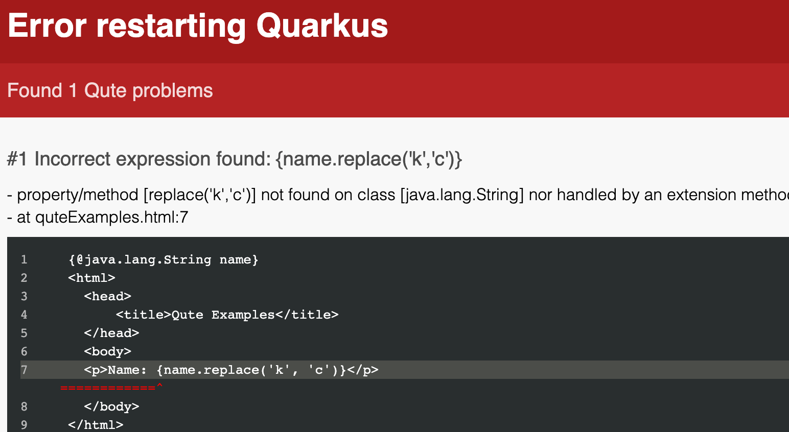

# Qute


## Connaissances obtenues

A l’issue de ce module, vous devriez :
* Comprendre les motivations derrières Qute
* Apprendre à créer et utiliser une template Qute
* Apprendre à créer des tags Qute personnalisés et des extensions de méthodes


## Moteur de template Qute

Quarkus est livré avec un moteur de template appelé *Qute* (**Qu**arkus **te**mplating):

* Une syntaxe simple
* Minimiser l'usage de la réflexion
* Optionnellement, sûreté du typage
* La sortie peut être streamée

Note:
* Minimizing reflection reduces the size of the native image.
* Optionally type-safe: we'll see this in later slides
* Output can be streamed: Uses HTTP chunking to reduce required memory.
* Can talk here about what the templates are compiled to, and how this works in native mode
* IMPORTANT: Need to mention that it is Experimental -- no guarantee of stability until the solution matures. Maybe this is a good transition for discussing Quarkus extensions in general


## Detour: Quarkus Extensions
* Can think of them as project dependencies, but with added dimensions
  * Build-time augmentation
* They help third-party libraries integrate more easily into Quarkus applications and build
* Integrations can more easily target GraalVM
* Statuses: `Stable`, `Preview`, `Experimental`

Note:
* Can mention that developers can write their own extensions, although we won't cover that in this course


## Les expressions de Qute

Avec une classe `Product` donné:
```java
public class Product {
    public String name;
    public BigDecimal price;
}
```

C’est une template présentant les détails d’un produit :
```html
<html>
  <head>
    <title>{product.name}</title>
  </head>
  <body>
    <h1>{product.name}</h1>
    <div>Price: {product.price}</div>
  </body>
</html>
```


## Iterations avec Qute

Vous pouvez faire l’itération d’une collection:

```html
<ul>
{#for product in products}
  <li>{product.name}</li>
{/for}
</ul>
```

Note:
Inside {for} there are values available such as index, hasNext, odd, even, count


## Quelques opérateurs Qute

Qute possède quelques opérateurs utiles:

```html [|1|2|3|5|6|]
Manufacturer: {product.manufacturer ?: 'Unknown'}
Manufacturer: {product.manufacturer or 'Unknown'}
Available: {product.isAvailable ? 'Yep' : 'Nope' }

{product.isAvailable && product.isCool}
{product.isAvailable || product.isCool}
```

Note:
* First two lines are _Elvis operator_, resolve to the default value if the previous part cannot be resolved or resolves to null
* Third line is the _ternary operator_.


## Utilisation de Qute

```java [|1-2|6|8|]
@Inject
Template productDetails;

@GET
@Path("{productId}")
public TemplateInstance product(@PathParam("productId") long productId) {
  Product product = Product.findById(productId);
  return productDetails.data("product", product);
}
```

1. Injection d’un template. Quarkus dérive le nom du fichier du template file à partir du nom du champ.
2. La méthode dans la ressource retourne un `TemplateInstance`. RESTeasy sait comment le convertir en réponse HTML.
3. Alimente le template avec les données pour créer un `TemplateInstance`.


<!-- .slide: data-background="#abcdef" -->
## Exercice: Un Hello World avec Qute

Note:
* Point out that they can go to the Dev UI and preview the template by passing some JSON


## Méthodes virtuelles Qute

Qute autorise l’appel de méthodes virtuelles sur des valeurs. Elles sont appelées virtuelles car elles ne correspondent pas à de réelles méthodes dans l’objet Java:

```html [|1|2-3]
<p>Name: {name}</p>
<p>Name: {name.toUpperCase()}</p>
<p>Name: {name.toUpperCase}</p>
```

Note:

* `toUpperCase` is a nullary method on Java's String. We can call that, with or without parentheses


## Méthodes virtuelles Qute

```java [|1|3-9|]
@TemplateExtension
public class StringExtension {
    public static String shout(String in) {
        return in + "!";
    }

    public static String shout(String in, String append) {
        return in + append;
    }
}
```

```html [|1|2|3|]
<p>Name: {name.shout}</p>
<p>Name: {name.shout('!!!')}</p>
<p>Name: {name shout '!!!'}</p>
```

Note:
* `shout` is a virtual method. In fact there are two virtual methods, with and without parameters
* In the last line, we use infix notation


## Méthodes virtuelles Qute

Nous ne pouvons appeler des méthodes _réelles_ avec des paramètres:

    <p>Name: {name.replace('k', 'c')}</p>

Affichera:

    <p>Name: NOT_FOUND</p>


## Méthodes virtuelles Qute - Template Data

Mais nous pouvons apprendre à Qute à générer un _value resolver_ pour nous:

    @TemplateData(target = String.class)

Maintenant cela fonctionne comme attendu:

    <p>Name: {name.replace('k', 'c')}</p>

Note:
// Try to explain value resolvers a bit more.


## Templates à typage-sûr

Dans l’exemple précédent, nous avons vu la ligne suivante

     <p>Name: {name.replace('k', 'c')}</p>

affichait `NOT_FOUND`, lors de l'exécution. Nous pouvons améliorer cela, et faire en sorte que Qute génère une erreur à l'exécution, en indiquant dans le template que la valeur attendue est du type `String`:

```html [|1,7|]
{@java.lang.String name}
<html>
  <head>
      <title>Qute Examples</title>
  </head>
  <body>
  <p>Name: {name.replace('k', 'c')}</p>
  </body>
</html>
```


## Templates à typage-sûr

Maintenant, Qute devrait afficher une erreur:




<!-- .slide: data-background="#abcdef" -->
## Exercice: Produits avec Qute, partie 1


<!-- .slide: data-background="#abcdef" -->
## Exercice: Produits avec Qute, partie 2


# Récapitulatif

Dans ce module nous avons:
* Discuté pourquoi Qute a été créé et comment il est différent des autres moteurs de templating
* Créé un template Qute et utilisé celui-ci à partir d’une Ressource
* Vu comment créer des tags personnalisés et des extensions de méthodes
* Vu comment créer des templates à typage-sûr
