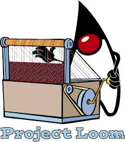

# Programmation réactive


<!-- .slide: data-visibility="hidden" -->
## Connaissances obtenues

Après ce module, vous devrez :
* ...


## Modèle d’exécution

Lors de l’utilisation de RESTEasy, *impératif* par défaut, Quarkus créé autant de `executor` threads que nécessaire, jusqu'à atteindre le maximum configuré:

```java [|6|]
@GET
@Path("/slow")
public String slow() throws InterruptedException {
    String thread = Thread.currentThread().getName();
    System.out.println("Thread: " + thread);
    Thread.sleep(1000);
    return thread;
}
```

``` [|1|8|]
ab -c 50 -n300  http://127.0.0.1:8081/threads/slow
...
Connection Times (ms)
              min  mean[+/-sd] median   max
Connect:        0    0   0.7      0       3
Processing:  1002 1009   6.8   1007    1037
Waiting:     1002 1009   6.8   1007    1037
Total:       1002 1010   7.4   1007    1039
```

La configuration par défaut du maximum est `max(200, 8 * nr_of_cores)`

Note:
Ce que nous voyons ici, c'est que si nous exécutons 50 requêtes simultanées, elles sont toutes exécutées en parallèle.


## Modèle d’exécution

Si nous limitons volontairement le nombre maximal de fils (threads):

```quarkus.thread-pool.max-threads=10```

Alors l’exécution de la même commande `ab` prend beaucoup plus longtemps:

``` [|8|]
ab -c 50 -n300  http://127.0.0.1:8081/threads/slow
...
Connection Times (ms)
              min  mean[+/-sd] median   max
Connect:        0    0   0.5      0       2
Processing:  1020 4679 959.9   5021    5068
Waiting:     1020 4679 960.0   5020    5068
Total:       1022 4680 959.5   5021    5070
```

Note:
Ce que nous voyons ici, c'est que si nous réduisons le nombre maximum de threads, nous voyons que de nombreuses requêtes doivent attendre avant d'être traitées.


## Modèle d’exécution - Threads bloquants

Deux choses qui peuvent occuper un thread :

* Effectuer une tâche utile sur le CPU
* Attendre quelqu’un d’autre (Base de données, Appel d’API, E/S Disque, etc.). C’est ce que l’on appelle _(bloquage) blocking_.

Note:
Expliquez ce qui suit :
* Faire un travail utile sur le CPU, c'est bien. C'est pour ça que nous l'avons. Si tous les processeurs sont occupés à faire un travail utile, nous avons une grande utilisation de nos ressources et nous pouvons être heureux.
* Attendre les autres c'est bien, c'est une réalité. Mais cela signifie que nous devons *faire autre chose* avec le processeur.

Supposons donc que nous ayons 4 cœurs et 10 threads. Si 5 threads calculent activement des choses et que 5 threads sont bloqués, il n'y a pas de problème. Mais si 8 threads sont bloqués et que 2 seulement font un travail CPU utile, c'est un problème.

C'est pourquoi Quarkus s'assure qu'il y a un nombre royal de threads : au moins 200 dans la configuration par défaut. On peut donc avoir au moins 200 requêtes simultanées.

Mais il y a une limitation : Quarkus ne peut pas faire la distinction entre un thread bloqué sur CPU et un thread bloqué sur E/S. Si les 200 threads sont utilisés pour le CPU, cela provoquera une _pénurie de threads_ : le calcul ne progresse pas beaucoup, car un thread n'est planifié qu'occasionnellement.

Dans le chapitre suivant, nous verrons un modèle différent qui résout ce problème.

## CPU vs E/S Non-bloquant E/S vs E/S bloquantes

Rappelez vous la dernière section :

* Un thread occupant le CPU est bon, mais nous ne voulons pas trop de ceux-ci.
* Un thread effectuant des E/S est bien, mais il ne devrait pas empêcher les autres threads d’effectuer des opérations sur le CPU.

<div class="fragment">
Solution ?

<ul>
<li> Avoir un nombre limité de threads qui effectue de taches sur le CPU
<li> Essayer d’effectuer les E/S sans bloquer un thread
<li> Et si c’est impossible, avoir éventuellement un nombre illimité de threads d’attente des E/S.
</ul>
</div>


## RESTEasy Reactive

L’extension `quarkus-resteasy-reactive` ajoute un support du modèle réactif de JAX-RS à Quarkus.

```xml
<dependency>
  <groupId>io.quarkus</groupId>
  <artifactId>quarkus-resteasy-reactive</artifactId>
</dependency>
```

```java
@GET
@Path("/hello")
public String hello() {
  return "Hello World";
}
```

Par exemple la définition du point d’entrée REST fonctionne exactement comme la version impérative.


## RESTEasy Reactive

L’extension `quarkus-resteasy-reactive` ajoute un support du modèle réactif de JAX-RS à Quarkus.

```xml
<dependency>
  <groupId>io.quarkus</groupId>
  <artifactId>quarkus-resteasy-reactive</artifactId>
</dependency>
```

```java [|4|]
@GET
@Path("/hello")
@Produces(MediaType.TEXT_PLAIN)
public CompletionStage<String> hello() {
  return CompletableFuture.completedFuture("Hello!");
}
```

Mais nous pouvons également retourner un `CompletionStage`


## Le modèle d’exécution réactif

RESTEasy reactive n'est pas indifférent aux bloquages

* Votre méthode sera appelée par le thread de la boucle d’évènement Vert.x (eventloop)
* Vous ne devriez pas le bloquer
* Mais si vous devez, annoter avec `@Blocking`


## Le modèle d’exécution réactif

### Exemple

```java
@GET
@Path("/regular")
public String regular() {
  return Thread.currentThread().getName();
}
```

C’est bien - retourne le nom du thread de la boucle Vert.x, par exemple `vert.x-eventloop-thread-3`


## Le modèle d’exécution réactif

### Mauvais exemple

```java [|4|]
@GET
@Path("/regular-slow")
public String regularSlow() {
  Thread.sleep(1000);
  return Thread.currentThread().getName();
}
```

Ce n’est pas correct.

Note:
Here we block the eventloop thread for IO. Ask the audience what they expect to happen if we measure this with a high number of concurrent requests?

See next page for the results

Ici nous avons bloqué le thread de la boucle d'événements pour de l’E/S. Demander à l’audience ce qui pourrait arriver si on mesurait la performance de ceci avec un grand nombre de requêtes concurrentes ?

Voir la page suivante pour les résultats


## Le modèle d’exécution réactif

### Mauvais exemple

``` [|1|8|9-10|]
ab -c50 -n300  http://127.0.0.1:8082/threads/regular-slow

Connection Times (ms)
min  mean[+/-sd] median   max
Connect:        0    1   0.7      0       3
Processing:  1005 2013 402.7   2012    3087
Waiting:     1005 2012 402.7   2012    3087
Total:       1007 2013 402.3   2013    3088
WARNING: The median and mean for the initial connection time are not within a normal deviation
These results are probably not that reliable.
```

Note:
Demandez au public s'il peut deviner combien de threads d'E/S sont prêts à l'emploi dans Quarkus ?

Answer:
* Nous exécutons 50 requêtes simultanément, et vous voyez que la plus lente prend 3 secondes. Cela nous donne entre 17 et 24 threads pour obtenir ce comportement.
* D'après la documentation de Quarkus, c'est le double du nombre de cœurs.
* Cette mesure a été effectuée sur 6 cœurs avec hyperthreading, donc effectivement 12 cœurs et 24 threads E/S. Nous avons bien deviné !
* 
Notez également que AB trouve les résultats suspects :)


## Le modèle d’exécution réactif

### Bon exemple

```java [|2|]
@GET
@Path("/regular-slow")
@Blocking
public String blockingSlow() {
  Thread.sleep(1000);
  return Thread.currentThread().getName();
}
```

Ceci retourne `executor-thread-221`

Note:
Et rappelez-vous que ces threads sont très nombreux et que vous pouvez les lier en toute sécurité en bloquant les E/S.


## Le modèle d’exécution réactif

### Bon exemple

```
ab -c70 -n300  http://127.0.0.1:8082/threads/blocking-slow

Connection Times (ms)
              min  mean[+/-sd] median   max
Connect:        0    1   0.7      1       3
Processing:  1001 1008   4.5   1007    1023
Waiting:     1001 1008   4.5   1007    1023
Total:       1001 1009   4.9   1008    1024
```

Retour à des performances normales :)

Note:
Ici, nous voyons que si nous disons à Quarkus que notre méthode bloque, il l'exécutera avec un thread d'exécution ; dont il y en a beaucoup plus disponibles.


## Le modèle d’exécution réactif

### Un exemple encore meilleur

Évidemment, nous pouvons faire encore mieux, en ne bloquant pas du tout le thread :

```java [|3|5|6-7|]
@GET
@Path("/nonblocking-slow")
public Uni<String> nonblockingSlow() {
  return Uni.createFrom().item(Thread.currentThread().getName())
    .onItem().delayIt().by(Duration.ofSeconds(1))
    .onItem().transform(i ->
      "Initial: " + i + ", later: " + Thread.currentThread().getName());
}
```

La sortie:
    Initial: vert.x-eventloop-thread-18, later: executor-thread-1

Note:
Cela démontre une « attente » asynchrone. Aucun thread n'est bloqué ici. La partie initiale du calcul est effectuée sur le thread E/S Vert.x. La méthode `delayIt` ne bloque pas, renvoie simplement un `Uni` qui se termine après le temps spécifié. Le travail continu avec cet `Uni` n'est pas effectué par un thread E/S.


## Reactive Routes

Une alternative à _RESTEasy Reactive_ est d’utiliser l’extension _Reactive Routes_:

> Reactive routes propose une approche alternative pour implémenter des endpoints HTTP où vous déclarez et enchaînez des routes. Cette approche est devenue très populaire dans le monde JavaScript, avec des frameworks comme Express.Js ou Hapi. Quarkus offre également la possibilité d'utiliser le routage réactif. Vous pouvez implémenter l'API REST avec des routes uniquement ou les combiner avec des ressources et des servlets JAX-RS.

Note:
Cette extension est également connue sous le nom de 'Vert.x web'

> Reactive routes propose une approche différente à l’implémentation des points d’entrée HTTP où vous déclarez et enchaînez des routes. Cette approche a été popularisée par le monde JavaScript, avec des frameworks comme Express.Js et Hapi. Quarkus offre également la possibilité d’utiliser le routage réactif. Vous pouvez implémenter ne API REST avec des routes seules ou les combiner avec des resources ou des servlets JAX-RS.


## Reactive Routes

```java [|1-5|7-10|12-16|]
@Route(methods = HttpMethod.GET)
void hello(RoutingContext rc) {
    rc.response().end("hello");
}

@Route(path = "/hello")
Uni<String> hello(RoutingContext context) {
  return Uni.createFrom().item("Hello world!");
}

@Route(produces = "application/json")
Person createPerson(@Body Person person, @Param("id") Optional<String> primaryKey) {
  person.setId(primaryKey.map(Integer::valueOf).orElse(42));
  return person;
}
```

Note:
1. Aucun chemin ou regex défini, chemin dérivé du nom de la méthode ! Montrez comment travailler avec le `RoutingContext`, qui est une classe Vert.x.
2. Affichez le retour d'un Uni au lieu de mettre la réponse sur le `RoutingContext`
3. Affichez l'utilisation des paramètres

Also:
Au lieu d'injecter `RoutingContext`, vous pouvez également choisir d'autres classes de modèles Vert.x ou Quarkus ou même Mutiny HTTP. Choisissez-en simplement un avec lequel vous aimez travailler ou qui dispose des éléments dont vous avez besoin facilement.

Comment choisir entre cela et RESTEasy Reactive ?
- RESTEasy Reactive est _expérimental_ depuis février 2021
- Vert.x Web est stable, donc généralement un meilleur choix.


# Accès réactif à la base de données


## A propos de JDBC

JDBC est une API bloquante

Exemple:

    ResultSet rs = stmt.executeQuery(query);

Il n’existe pas de solution pour obtenir le `ResultSet` sans thread bloquante.

Note:
Remarquez que vous n'avez pas nécessairement à bloquer le thread sur lequel vous travaillez. Bien sûr, vous pouvez exécuter l'appel sur un thread différent et obtenir un `CompletionStage` ici. Mais alors vous devez bloquer cet autre thread !

Bien sûr, ce n'est pas un gros problème dans la plupart des applications, pour plusieurs raisons :
- Les bases de données n'aiment pas les milliers de requêtes simultanées, donc nous mettrons probablement les requêtes en file d'attente si nous en avons beaucoup quoi qu'il arrive
- Comme indiqué, Quarkus peut gérer un nombre relativement important de threads pouvant être bloqués sur les E/S
- Pour les grosses applications, le surcoût de plusieurs dizaines de threads pour cela n'est pas énorme

Mais pour *supersonique* *subatomique* on peut mieux faire !


## Hibernate devient Réactif

Depuis Décembre 2020, Hibernate Reactive a été lancé:

```java
Uni<Book> bookUni = session.find(Book.class, book.id);
bookUni.invoke( book -> System.out.println(book.title + " is a great book!") )
```

C’est une API réactive pour Hibernate ORM.


## Hibernate devient Réactif

* Fonctionne avec les clients non-bloquant d'accès aux bases de données. Pour le moment, les clients Vert.x pour Postgres, MySQL et DB2
* L’intégration avec Quarkus est agréable
* Pas de _lazy_ chargement bloquant, mais des opérations asynchrones explicites pour récupérer les associations

Note:
Une autre chose à mentionner, les créateurs _ne s'attendent pas à ce que ce soit plus rapide que l'ORM Hibernate ordinaire_. Ils ne s'attendent pas à ce que de nombreuses applications en bénéficient. Cependant, ils s'attendent à une meilleure dégradation sous charge pour certaines applications, et il y aura peut-être des améliorations de performances à l'avenir.


## Hibernate Reactive + Panache

* Les méthodes qui retournent `T` ou `List<T>` retourne maintenant `Uni<T>` et `Uni<List<T>>`
* Nouvelles méthodes `streamXXX` qui retournent `Multi<T>`
* Les classes sont dans un nouveau package `io.quarkus.hibernate.reactive`


## Hibernate Reactive + Panache usage

```java
@GET
public Multi<Product> products() {
    return Product.streamAll();
}

@GET
@Path("{productId}")
public Uni<Product> details(@PathParam("productId") Long productId) {
    return Product.findById(productId);
}
```

Note:
* Ici, nous avons modifié le endpoint `products` pour utiliser une méthode `streamXXX` d'Hibernate afin d'obtenir un `Multi`
Remarquez la différence entre `Uni<List<T>>` et `Multi<T>` : L'`Uni<List<T>>` mettra la liste en mémoire, tandis que le Multi est entièrement en streaming.


## Mutiny, Uni & Multi

**Mutiny** est la librarie pour la programmation réactive que Quarkus utilise. Il y a deux types principaux:

- `Multi<T>` représente un stream d’éléments de type `T`
- `Uni<T>`, représente un stream de zéro ou un élément de type `T`

Note:
* Mentionnez que Multi est potentiellement illimité
* Mentionnez qu'ils prennent également en charge l'indication d'échec.
* Mentionnez que nous *en apprendrons beaucoup plus sur ces types dans des diapositives ultérieures*
* Mentionnez qu'Hibernate Reactive a deux API : une utilisant les types Mutiny et une utilisant les types Java Stdlib : `CompletionStage` et `Publisher`.


## RESTEasy Reactive with Mutiny Uni

Les `Uni`s sont supportés comme un type de résultat:
```java [|3|4]
@GET
@Produces(MediaType.TEXT_PLAIN)
public Uni<String> helloUni() {
    return Uni.createFrom().item("Hello!");
}
```

Note: Encore une fois, un `Uni` est comme un flux qui émet jusqu'à un élément. Mais il peut aussi être annulé ou échouer.

## RESTEasy Reactive

`Multi` est aussi supporté:

```java
@GET
@Produces(MediaType.TEXT_PLAIN)
public Multi<String> helloMulti() {
  return Multi.createFrom().items("Hello", "world!");
}
```

Cela retourne une réponse HTTP `chunked`.

Note: Meaning that Quarkus doesn't need to create the full response in memory before sending it.

So it can support arbitrarily long HTTP responses in bounded memory.

Cela sous-entend que Quarkus n’a pas besoin de créer la réponse entière en mémoire avant de l’envoyer.
Donc il peut supporter arbitrairement de longue réponse HTTP sans consommer trop de mémoire.


<!-- .slide: data-background="#abcdef" -->
## Exercise: Going Reactive


## Sessions & Transactions

```java
session.find(Product.class, id)
    .call(product -> session.remove(product))
    .call(() -> session.flush())
```

Note:
- Le point majeur à souligner ici est que les 'sessions' et les 'transactions' ne sont plus liées aux threads, mais doivent être explicitement gérées.
- De Hibernate Session, plusieurs variants sont également disponibles; un pour les types Java standardlib et un pour les types Mutiny !
- Ce sont des exemples sans Panache, utilisant directement Hibernate


## Sessions & Transactions - Exemple

Bon exemple:
```java
Uni<Product> product = session.find(Product.class, id)
    .call(session::remove)
    .call(session::flush)
```

Mauvais exemple:
```java
Uni<Product> product = session.find(Product.class, id)
    .call(session::remove)
    .invoke(session::flush)
```

Les méthodes:
```java
Uni<T> call(Supplier<Uni<?>> supplier)
Uni<T> invoke(Runnable callback)
```

Les deux exemples compilent et possèdent les types correctes, mais le deuxième _déclenchera jamais l'operation `flush`_.

Note:
* Cela montre une erreur courante. Ces deux exemples compilent, mais le second _n'exécutera jamais le flush_.

C'est parce que `call` attend un `Uni`, _et s'y abonne_ lorsque l'`Uni` 'extérieur' (contenant le produit) y est abonné (depuis find), alors même que le _résultat_ de l'Uni créé par Flush est ignoré.
Mais `invoke` ne souscrit jamais au `Uni` renvoyé par `invoke`.

Les personnes familières avec la programmation réactive en auront déjà fait l'expérience !


## Clients SQL Réactifs Low-level

Une autre possibilité pour se connecter à la base de données est d’utiliser un client SQL low-level.
```
PgConnectOptions connectOptions = new PgConnectOptions()
  .setPort(5432)
  .setHost("the-host")
  .setDatabase("the-db")
  .setUser("user")
  .setPassword("secret");

// Pool options
PoolOptions poolOptions = new PoolOptions()
  .setMaxSize(5);

// Create the client pool
PgPool client = PgPool.pool(connectOptions, poolOptions);
```

L’objet de base dont nous avons besoin est une instance de `PgPool`.

Note:
^ Remarquez que dans Quarkus, *bien sûr* nous pouvons simplement le configurer dans la configuration unifiée, ce n'est donc pas nécessaire.


## Clients SQL Réactifs Low-level

```
@Inject
PgPool client;
```

Récupérer le bon `PgPool`:
* `io.vertx.mutiny.pgclient.PgPool` uses Mutiny types
* `io.vertx.pgclient.PgPoool` uses Vert.x types

Note:
Ils sont créés avec un générateur de code. Il existe également des variantes pour RxJava 2 et RxJava 3. Mais lorsque vous utilisez Quarkus, vous en tenir aux variantes Mutiny est certainement votre meilleure option.


## Requêtage

Les requêtes retournent un `Uni` contenant un `RowSet`:

    Uni<RowSet<Row>> rowSetUni = client.query("SELECT name, age FROM people").execute();

Bien sûre, nous pouvons transformer cela par un `Multi` de `Rows`:

    Multi<Row> people = client.query("SELECT name, age FROM people").execute()
        .onItem().transformToMulti(set -> Multi.createFrom().iterable(set));


## Requêtage

```java
Multi<Person> people = client.query("SELECT name, age FROM people")
  .execute()
  .onItem().transformToMulti(rows -> Multi.createFrom().iterable(rows))
  .onItem().transform(Person::fromRow);
```

```java
static Person fromRow(Row row) {
  return new Person(row.getString("nam"), row.getInteger("age"));
}
```

Note:
Expliquez comment `onItem` et `transform` ne sont que des méthodes Mutiny ordinaires
Expliquez que `RowSet` est un itérateur qui lit à partir de la base de données lorsque cela est demandé.

Expliquez comment nous pouvons utiliser une méthode statique sur Person et une référence de méthode pour mapper proprement d'une `Row` à une `Person`


## Paramétres

```java [|1|2|3|]
client.preparedQuery(
    "SELECT id, name FROM fruits WHERE id = $1")
    .execute(Tuple.of(id))
```

Note:
Expliquez que ce `Tuple` vient de Mutiny.


## Insertions et Mise à jour

```java [|1|2|3|4|]
  Uni<Long> personId = client
    .preparedQuery("INSERT INTO people (name, age) VALUES ($1, $2) RETURNING id")
    .execute(Tuple.of(name, age))
    .onItem().transform(pgRowSet -> pgRowSet.iterator().next().getLong("id"));
}
```

Note:
Expliquez que nous récupérons l'ID généré à partir de la base de données.


<!-- .slide: data-background="#abcdef" -->
## Exercise: Reactive search endpoint


## Listen & Notify

L’une des propriétés sympa de Postgres est d’écouter (`Listen`) des canaux. Dans le cadre des transactions, vous pouvez notifier les canaux, par exemple pour alerter les consommateurs qui attendent un événement.

Note:
Cela se prête très bien à la programmation réactive : gardez une connexion ouverte à Postgres, ayez un flux sortant d'abonnements/désabonnements et un flux de notifications en retour.


## Listen & Notify

```java
@Path("/listen/{channel}")
@GET
@Produces(MediaType.SERVER_SENT_EVENTS)
@RestSseElementType(MediaType.APPLICATION_JSON)
public Multi<JsonObject> listen(@PathParam("channel") String channel) {
  return client.getConnection()
    .onItem().transformToMulti(connection -> {
      Multi<PgNotification> notifications = Multi.createFrom().
        emitter(c -> toPgConnection(connection).notificationHandler(c::emit));
      return connection.query("LISTEN " + channel).execute().onItem().transformToMulti(__ -> notifications);
    }).map(PgNotification::toJson);
}
```

```java
@Path("/notify/{channel}")
@POST
@Produces(MediaType.TEXT_PLAIN)
@Consumes(MediaType.WILDCARD)
public Uni<String> notif(@PathParam("channel") String channel, String stuff) {
    return client.preparedQuery("NOTIFY " + channel +  ", $$" + stuff + "$$").execute()
            .map(rs -> "Posted to " + channel + " channel");
}
```

Note:
La première image montre `LISTEN`, nous commençons à écouter un _channel_ Postgres. Chaque notification pour ce canal se retrouve dans le Multi, et sera donc observée par quelqu'un qui se connecte au endpoint SSE.

Bien sûr, ainsi nous faisons une nouvelle connexion par client qui se connecte. Demandez aux personnes; que pourrions-nous faire pour améliorer cela ? Réponse : broadcast.

La deuxième image montre `NOTIFY`


## Listen & Notify

```shell
➜ http localhost:8082/db/listen/milkshakes --stream
HTTP/1.1 200 OK
Content-Type: text/event-stream
X-SSE-Content-Type: application/json
transfer-encoding: chunked

data:{"channel":"milkshakes","payload":"{\"flavour\": \"banana\"}","processId":57}

data:{"channel":"milkshakes","payload":"{\"flavour\": \"strawberry\"}","processId":58}
```

```shell
➜ http POST localhost:8082/db/notify/milkshakes flavour=banana
HTTP/1.1 200 OK
Content-Type: text/plain
content-length: 28

Posted to milkshakes channel

➜ http POST localhost:8082/db/notify/milkshakes flavour=strawberry
HTTP/1.1 200 OK
Content-Type: text/plain
content-length: 28

Posted to milkshakes channel
```

Note:
La première capture d'écran montre la connexion au endpoint RESTful SSE 'listen' avec le path param 'milkshakes'.

La deuxième capture d'écran montre la publication de messages sur le endpoint 'notify' avec le path param 'milkshakes' et un request body.

Dans la première capture d'écran, vous voyez ceux-ci entrer.

TODO, peut-être préparer une petite démo ?


<!-- .slide: data-background="#abcdef" -->
## Exercise: Listen & Notify

Note:

Différentes façons de remplir la partie manquante

```java
.onItem().transformToMulti(rows -> Multi.createFrom().iterable(rows))
.map(Product::from)
```

```java
.toMulti().flatMap(rows -> Multi.createFrom().iterable(rows))
.map(Product::from)
```

```java
.onItem().<Row>disjoint()
.map(Product::from)
```


<!-- .slide: data-visibility="hidden" -->
## Qu’est ce qui approche (looming) à l’horizon ?



Note:
Explain a bit about Project Loom:
- Upcoming changes to the JDK, to support _virtual threads_, aka fibers, threads that don't consume an OS thread and thus don't suffer from the memory-overhead and poor cache behavior of regular threads. With Loom it is possible to create millions of virtual threads!
- Loom will make most existing JDBC drivers suddenly non-blocking, because all networking API's will be reimplemented in a non-blocking fashion. User code won't have to change
- Game changer for many applications, but also quite far away. Unlikely to make the Java 17 LTS, so maybe the first LTS that has it will be Java 23, due in 2024, so used at a company near you in 2026...


# Reactive Streams


## Reactive Streams

Les flux de données (*Streaming data*) sont fréquents dans les applications modernes:

- Flux d’évènements d’un système vers des consommateurs
- Flux d’enregistrements d’une base de données vers une réponse HTTP chunked (découpée en gros morceaux)
- Messages consommés depuis une queue, transformés et déposés dans une autre queue

<p class="fragment">Un problème fondamental des systèmes de traitement de flux de données est d’avoir l’assurance que le <em>consommateur</em> du flux peut traiter les messages qu’on lui envoie.</p>


## Consommateur lent

Supposons que vous ayez un système qui lit les enregistrements d'une base de données, les transforme en JSON et les stocke dans un fichier.

*Question :* Que se passe-t-il si vous lisez 1000 enregistrements par seconde, mais que vous ne pouvez en écrire que 500 par seconde dans des fichiers ?

Note:
Réponse : la mémoire se remplira jusqu'à ce que le système plante.


<!-- .slide: data-visibility="hidden" -->
## Consommateur lent

Note:
TODO, draw diagram of slow consumer being overloaded by fast producer


## Consommateur lent - solutions

Solutions possibles:
* <!-- .element: class="fragment" -->Avoir un consommateur réellement rapide
* <!-- .element: class="fragment" -->Avoir un producteur lent
* <!-- .element: class="fragment" -->Avoir plus de mémoire que la taille de votre base de données
* <!-- .element: class="fragment" -->Adapter la vitesse du producteur, basé sur la capacité du consommateur

Note:
Ce dernier est essentiellement ce qu'on appelle la back-pressure. Le consommateur peut indiquer combien il veut lire.


## Back pressure

La *Back pressure* signifie que le consommateur peut faire la *demande* au producteur. Le producteur ne produira que la quantité demandée par le consommateur.

Note:
TODO, dessiner un diagramme d'un consommateur indiquant la demande.


## Back pressure

* Fonctionne avec le flux entier, et pas juste avec le consommateur à la fin
* Chaque élément peut adapter la demande qui a été envoyée en amont
  - Les composants lents réduisent la demande
  - Quelques composants, comme les buffers, peuvent augmenter la demande


## Les flux au dessus TCP

* TCP supporte nativement la back-pressure!
* Les messages *ack* *(accusés)* contiennent un champ *window* *(fenêtre)*, indiquant comment l’expéditeur doit faire l’envoi.
* Quand le destinataire reçoit les données, un nouvel accusé est envoyé, avec une fenêtre plus grande.

Note:
Nous pouvons donc créer des systèmes de contre-pression réactifs sur TCP. Par exemple, en utilisant des réponses HTTP fragmentées.


<!-- .slide: data-visibility="hidden" -->
## Comparaison avec JMS

* Interface bloquante: nous ne voulons pas d’interface bloquante
* Interface asynchrone: ne supporte pas la back pressure


## Les flux réactifs standards

A partir de 2013, les ingénieurs de Netflix, Pivotal, Lightbend, Twitter et d’autres ont tous travaillés autour des systèmes de flux, essentiellement en résolvants les mêmes problèmes.

Pour être certain que leurs librairies seront compatibles, ils ont mis en place un standard de **Reactive Streams**.

C’est une interface minimale nécessaire pour connecter les librairies de flux, retenant toutes les opérations non bloquantes, la back-pressure, le partage de l’annulation et le modèle d’erreur.


## Les flux réactifs standards

Terminé dans la bibliothèque standard Java à partir de Java 9, sous `java.util.concurrent.Flow`.

Note:
Le standard lui-même est très petit, vous ne pouvez pas vraiment programmer directement dessus. Par exemple, il n'y a pas de méthodes `map` ou `filter` dans la bibliothèque standard.

Vous devez donc utiliser une *implémentation* de la norme pour effectuer un travail de streaming significatif.


## Les implémentations de flux réactif

* Akka Streams
* RxJava
* Reactor
* Vert.x
* Mutiny
* ... et bien d’autres

Note: Mutiny est celui utilisé par Quarkus. Il fait partie de Smallrye. Nous l'avons déjà utilisé dans la section DB.

Mais certaines parties de l'implémentation Vert.x sont également utilisées, puisque Quarkus utilise aussi Vert-x.


## Démarrage

```java [1|2|3|4]
Multi<String> greeter = Multi.createFrom().items("Hello", "world");
Uni<List<String>> out = greeter.collectItems().asList();
List<String> results = out.subscribe().asCompletionStage().join();
System.out.println(results);
```

Note:
Expliquez ligne par ligne :
1. Nous créons un *Multi*. Un Multi est un flux, paramétré par le type d'élément. Celui-ci en particulier est pour un flux * borné *. Nous savons combien il y a d'éléments. Mais l'abstraction est la même. Un `Multi` peut également être illimité.
2. Nous affectons les éléments dans une liste. Comme tout cela est non bloquant et asynchrone, il ne peut pas renvoyer cette liste telle quelle, mais il la renvoie dans un `Uni`. Un Uni est un flux spécial avec un élément. C'est assez similaire à un `CompletableFuture`. Notez qu'à ce stade, le flux n'a pas encore commencé !
3. Subscribe démarre le flux et `asCompletionStage` transforme l'Uni en un `CompletableFuture`, que nous bloquons ensuite en utilisant `join`.
4. Enfin, nous imprimons les résultats.

Évidemment, c'est à des fins de démonstration. Dans le vrai code, vous ne devriez presque jamais utiliser *join*. Au lieu de cela, les frameworks avec lesquels nous travaillons (comme Quarkus) prennent en charge le retour des Uni et Multi.


## Mutiny Uni

Un `Uni` n’est exécuté que lorsqu’il est connecté à un abonné (*subscriber*):

```java [1-6|8-9]
Uni<Integer> myUni = Uni.createFrom().item(() -> {
    System.out.println("Creating the item!");
    return 5;
});

// Nothing has been printed at this point

System.out.println("Subscribing:");
myUni.subscribe().with(System.out::println); // Prints 'Creating the item!' and '5'
```

Note:
Ceci est différent d'un `CompletionStage`, qui est déjà en cours d'exécution.

Un `Uni` est plus un descripteur d'une opération.


## Mutiny Multi

L’interface `Multi` de Mutiny étend `org.reactivestreams.Publisher<T>`, donc c’est un flux réactif.

Multi possède de nombreuse méthode pour interagir avec:

```java [1|2|3|4|5]
return Multi.createFrom().items("One", "Two", "Three", "Four", "Five", "Six")
        .map(String::toUpperCase)
        .filter(s -> s.length() >= 4)
        .flatMap(s -> Multi.createFrom().items(s.toCharArray()))
        .map(String::valueOf);
```

Note:
1. There many methods to *create* a Multi: From elements, from iterators, by imperatively pushing them in, from timer ticks. However, most typically as an application builder you won't create your own multi's, but obtain a multi from a library, like a Kafka connector, a Database connector, a web service client, a form upload, and transform that Multi.
2. The `map` method. Familiar from streams.
3. The `filter` method. Familiar from streams.
4. The `flatMap' method. To flatten nested Multi's.
5. Another `map`

There are many more, see the docs. Be aware; Quarkus uses a somewhat outdated Mutiny version sometimes.

Il y a plusieurs méthodes pour créer un Multi: à partir d’éléments, à partir d'itérateurs, en les poussant impérativement, à partir d’une horloge (timer ticks). Cependant, le plus souvent en tant que développeur d'application, vous ne créez pas vos propres multi, mais vous en obtiendrez un à partir d'une bibliothèque, comme un connecteur Kafka, un connecteur de base de données, un client de service Web, un téléchargement de formulaire et ensuite vous transformerez ce multi.
La méthode  map. Proche de celle de stream.
La méthode filter. Proche de celle de stream.
La méthode `flatMap'. Pour aplatir des multis imbriqués.
Autre map
Il y en a encore bien plus, lisez la documentation. Attention; Quarkus utilise
There are many more, see the docs. Be aware; Quarkus utilise parfois une version de Mutiny quelque peu obsolète.


## Mutiny Multi

Un abonné (subscriber) à un Multi, doit faire face aux situations suivantes:

* Un élément arrive
* Une erreur intervient
* Le flux (borné) et complété

```java [|3|4|5]
Cancellable cancellable = multi
.subscribe().with(
  item -> System.out.println(item),
  failure -> System.out.println("Failed with " + failure),
  () -> System.out.println("Completed"));
```

Note: If you check the Reactive Streams spec, this is also what you see.

Si vous vérifiez les spécifications des flux réactifs, c’est ce que vous pourrez lire.


## Visualisation des événements

```java [|1|2|3|4|5|6|7|8]
Multi.createFrom().items(1,2,3)
.onSubscribe().invoke(() -> System.out.println("⬇️ Subscribed"))
.onItem().invoke(i -> System.out.println("⬇️ Received item: " + i))
.onFailure().invoke(f -> System.out.println("⬇️ Failed with " + f))
.onCompletion().invoke(() -> System.out.println("⬇️ Completed"))
.onCancellation().invoke(() -> System.out.println("⬆️ Cancelled"))
.onRequest().invoke(l -> System.out.println("⬆️ Requested: " + l))
.subscribe().with(__ -> {}); // Drain
```

L’affichage est le suivant:
``` [|1|2|3-5|6]
⬇️ Subscribed
⬆️ Requested: 9223372036854775807
⬇️ Received item: 1
⬇️ Received item: 2
⬇️ Received item: 3
⬇️ Completed
```

Note:
Expliquer chaque ligne

Que se passe t-il ici?

Ce que nous voyons, c'est que la méthode `with` demande des éléments Long.MaxValue. Simplement, c'est un abonné qui n'applique jamais de back-pressure !


## Visualisation des événements

```java [|8-10]
Stream<Integer> out = Multi.createFrom().items(1,2,3)
        .onSubscribe().invoke(() -> System.out.println("⬇️ Subscribed"))
        .onItem().invoke(i -> System.out.println("⬇️ Received item: " + i))
        .onFailure().invoke(f -> System.out.println("⬇️ Failed with " + f))
        .onCompletion().invoke(() -> System.out.println("⬇️ Completed"))
        .onCancellation().invoke(() -> System.out.println("⬆️ Cancelled"))
        .onRequest().invoke(l -> System.out.println("⬆️ Requested: " + l))
        .subscribe().asStream();

Set<Integer> set = out.collect(Collectors.toSet());
```

Cela affiche:
``` [|2]
⬇️ Subscribed
⬆️ Requested: 256
⬇️ Received item: 1
⬇️ Received item: 2
⬇️ Received item: 3
⬇️ Completed
```

Note: Donc `asStream` ne demande que 256 éléments !


## Visualisation des événements

Nous pouvons configurer le nombre d’élément dans la queue:
```java [8-9]
Stream<Integer> out = Multi.createFrom().items(1,2,3)
  .onSubscribe().invoke(() -> System.out.println("⬇️ Subscribed"))
  .onItem().invoke(i -> System.out.println("⬇️ Received item: " + i))
  .onFailure().invoke(f -> System.out.println("⬇️ Failed with " + f))
  .onCompletion().invoke(() -> System.out.println("⬇️ Completed"))
  .onCancellation().invoke(() -> System.out.println("⬆️ Cancelled"))
  .onRequest().invoke(l -> System.out.println("⬆️ Requested: " + l))
  // Use a buffer capacity of 2
  .subscribe().asStream(2, () -> new ArrayBlockingQueue<>(2));

Set<Integer> set = out.collect(Collectors.toSet());
```

``` [2|3-4|5|6-7]
⬇️ Subscribed
⬆️ Requested: 2
⬇️ Received item: 1
⬇️ Received item: 2
⬆️ Requested: 2
⬇️ Received item: 3
⬇️ Completed
```

Note:
Notre buffer de 2 crée une demande de 2. Lorsqu'il est vide, il crée une nouvelle demande de 2.


## Visualisation des événements

Le flux créé par `asStream` devrait annuler (*cancel*) le `Multi` quand il est fermé (`close`).

```java [|11]
Stream<Integer> out = Multi.createFrom().items(1,2,3,4,5,6)
  .onSubscribe().invoke(() -> System.out.println("⬇️ Subscribed"))
  .onItem().invoke(i -> System.out.println("⬇️ Received item: " + i))
  .onFailure().invoke(f -> System.out.println("⬇️ Failed with " + f))
  .onCompletion().invoke(() -> System.out.println("⬇️ Completed"))
  .onCancellation().invoke(() -> System.out.println("⬆️ Cancelled"))
  .onRequest().invoke(l -> System.out.println("⬆️ Requested: " + l))
  .subscribe().asStream(2, () -> new ArrayBlockingQueue<>(2));

Set<Integer> set = out.limit(2).collect(Collectors.toSet());
out.close();
```

``` [|8]
⬇️ Subscribed
⬆️ Requested: 2
⬇️ Received item: 1
⬇️ Received item: 2
⬆️ Requested: 2
⬇️ Received item: 3
⬇️ Received item: 4
⬆️ Cancelled
```


## Stratégies de Backpressure

Principalement, il y a trois choses à faire quand le producteur va plus vite que le consommateur:

* Réduire la vitesse du producteur
* Bufferiser les éléments
* Jeter des éléments

Note:
- Nous avons vu le premier, c'est le back-pressure. Mais ce n'est pas toujours possible. Que faire si vous avez un flux en temps réel que vous ne pouvez pas mettre en pause ? Par exemple, si vous êtes connecté à Twitter, vous ne pouvez pas dire aux gens de ne pas tweeter pendant un certain temps.
- La seconde est viable dans certains cas. La mise en mémoire tampon fonctionne bien pour les petits pics. La mise en mémoire tampon à plus long terme peut être effectuée dans des systèmes comme Kafka.
- La troisième est parfois nécessaire. Les articles peuvent être échantillonnés, ou peut-être peuvent-ils être fusionnés à moindre coût.


## Stratégies de Backpressure

```java [|1|2-4|6-7|9-11|]
Multi.createFrom().ticks().every(Duration.ofMillis(10))
  .onItem().invoke(i -> System.out.println("A - ⬇️ Received item: " + i))
  .onFailure().invoke(f -> System.out.println("A - ⬇️ Failed with " + f))
  .onRequest().invoke(l -> System.out.println("A - ⬆️ Requested: " + l))

  .onItem().transformToUni(e -> Uni.createFrom().item(e).onItem()
        .delayIt().by(Duration.ofSeconds(1))).concatenate()

  .onItem().invoke(i -> System.out.println("B - ⬇️ Received item: " + i))
  .onFailure().invoke(f -> System.out.println("B - ⬇️ Failed with " + f))
  .onRequest().invoke(l -> System.out.println("B - ⬆️ Requested: " + l))
  .subscribe().with(__ -> {});`
```

Affiche:
``` [|1|2|3|4-5]
B - ⬆️ Requested: 9223372036854775807
A - ⬆️ Requested: 1
A - ⬇️ Received item: 0
A - ⬇️ Failed with io.smallrye.mutiny.subscription.BackPressureFailure: Could not emit tick 1 due to lack of requests
B - ⬇️ Failed with io.smallrye.mutiny.subscription.BackPressureFailure: Could not emit tick 1 due to lack of requests
```

Note:
1. We create a stream with ticks every 10 milliseconds
2. We call the first part of the stream the **A** part, and print messages as such
3. Next, there is a **slow** transformer, that basically transforms a single element per second.
4. We call the second part of the stream the **B** part
5. We see a ton of demand coming from the `subscribe.with`
6. But the `transform` only sends a demand of 1 upstream when it's not processing one already
7. So we see one element fly by
8. And then the stream crashes, because it's 'full': the stream wants to emit an element but there is no demand.

1. Nous créons un flux avec des ticks toutes les 10 millisecondes
2. Nous appelons la première partie du flux - la partie **A** - et imprimons les messages en tant que tels
3. Ensuite, il y a un transformateur **lent**, qui transforme essentiellement un seul élément par seconde.
4. Nous appelons la deuxième partie du flux, la partie **B**
5. Nous voyons une tonne de demande venant du `subscribe.with`
6. Mais le `transform` n'envoie qu'une demande de 1 en amont lorsqu'elle n'en traite pas déjà une
7. Nous voyons donc un élément passer
8. Et puis le flux plante, car il est 'plein' : le flux veut émettre un élément, mais il n'y a pas de demande.

## Rejeter les éléments en trop

```java [|5-6|]
Multi.createFrom().ticks().every(Duration.ofMillis(900))
  .onItem().invoke(i -> System.out.println("A - ⬇️ Received item: " + i))
  .onFailure().invoke(f -> System.out.println("A - ⬇️ Failed with " + f))
  .onRequest().invoke(l -> System.out.println("A - ⬆️ Requested: " + l))
  // Drop on overflow
  .onOverflow().drop()
  .onItem().transformToUni(e -> Uni.createFrom().item(e).onItem().delayIt().by(Duration.ofSeconds(1))).concatenate()
  .onItem().invoke(i -> System.out.println("B - ⬇️ Received item: " + i))
  .onFailure().invoke(f -> System.out.println("B - ⬇️ Failed with " + f))
  .onRequest().invoke(l -> System.out.println("B - ⬆️ Requested: " + l))
  .subscribe().with(__ -> {});
```

``` [|1-2|3-5|5,8|]
B - ⬆️ Requested: 9223372036854775807
A - ⬆️ Requested: 9223372036854775807
A - ⬇️ Received item: 0
A - ⬇️ Received item: 1
B - ⬇️ Received item: 0
A - ⬇️ Received item: 2
A - ⬇️ Received item: 3
B - ⬇️ Received item: 2
```

Note:
1. Nous ajoutons un `onOverflow.drop()` pour supprimer des éléments au cas où il n'y aurait pas de demande.
2. Nous voyons maintenant une demande infinie dans les deux endroits du flux
3. La position A voit les éléments 0 et 1, puis la position B voit l'élément 0.
4. Mais la position B ne voit jamais l'élément 1 ! Parce qu'il est tombé.


## Bufferisé

```java [|5-6|]
Multi.createFrom().ticks().every(Duration.ofMillis(900))
  .onItem().invoke(i -> System.out.println("A - ⬇️ Received item: " + i))
  .onFailure().invoke(f -> System.out.println("A - ⬇️ Failed with " + f))
  .onRequest().invoke(l -> System.out.println("A - ⬆️ Requested: " + l))
  // Buffer on overflow
  .onOverflow().buffer(10)
  .onItem().transformToUni(e -> Uni.createFrom().item(e).onItem().delayIt().by(Duration.ofSeconds(1))).concatenate()
  .onItem().invoke(i -> System.out.println("B - ⬇️ Received item: " + i))
  .onFailure().invoke(f -> System.out.println("B - ⬇️ Failed with " + f))
  .onRequest().invoke(l -> System.out.println("B - ⬆️ Requested: " + l))
  .subscribe().with(__ -> {});
```

```
B - ⬆️ Requested: 9223372036854775807
A - ⬆️ Requested: 9223372036854775807
A - ⬇️ Received item: 0
A - ⬇️ Received item: 1
B - ⬇️ Received item: 0
A - ⬇️ Received item: 2
B - ⬇️ Received item: 1
A - ⬇️ Received item: 3
B - ⬇️ Received item: 2
```

Note:
Ce que nous voyons ici, c'est que B reçoit tous les éléments. Évidemment, c'est jusqu'à un certain point; après un certain temps, la mémoire tampon est pleine et le flux continue de planter.

Other strategies, that mutiny currently doesn't have built in yet:
- Sampling
- Batching
- Conflating items (combining them)

D'autres stratégies, que Mutiny n'a pas encore intégrées actuellement :
- Sampling (Échantillonnage)
- Batching (Dosage)
- Conflating items (Assembler/combiner des objets)

Si vous souhaitez des fonctionnalités plus avancées, jetez un œil aux bibliothèques de flux réactifs plus avancées, comme RxJava ou Akka Streams.


## L’envoi d’événement depuis le serveur (Server-Sent Events)

L’envoi d’événement depuis le serveur (Server-Sent Events) est une technologie qui autorise le serveur à pousser des données à un client quand il le veut. Le client ouvre une connexion et la garde ouverte. Le serveur peut envoyer des données tronquées (chunks).


## Server-Sent Events

Ci-dessous un exemple d’un endpoint qui envoi des données tronquées toute les secondes, contenant la date et heure courante:

```java [|2|3|6-7|8]
@GET
@Produces(MediaType.SERVER_SENT_EVENTS)
@RestSseElementType(MediaType.TEXT_PLAIN)
public Multi<String> time() {
  return Multi.createFrom()
    .ticks()
    .every(Duration.ofSeconds(1))
    .map(__ -> LocalDateTime.now().toString());
}
```

``` [|1|2-4|5-10|11]
➜  lunatech-beginner-quarkus-course git:(main) ✗ http localhost:8082/time --stream
HTTP/1.1 200 OK
Content-Type: text/event-stream
X-SSE-Content-Type: text/plain
transfer-encoding: chunked
data:2021-02-23T14:09:59.233302
data:2021-02-23T14:10:00.237587
data:2021-02-23T14:10:01.236240
data:2021-02-23T14:10:02.236214
data:2021-02-23T14:10:03.236526
^C
```

Note:
1. Le endpoint produit des événements envoyés par le serveur
2. Chaque morceau a un type text/plain
3. Nous créons un Multi à partir de ticks. Les éléments ne sont qu'un compteur incrémental
4. Nous jetons l'élément et créons un nouvel élément contenant l'heure
5. Nous utilisons httpie avec `--stream` pour afficher chaque morceau tel qu'il arrive. Vous pouvez également utiliser `cURL`.
6. Chaque élément 'data:' est un morceau
7. Nous devons faire `Ctrl-C` pour interrompre, car c'est un flux sans fin :)

<!-- .slide: data-visibility="hidden" -->
## Recap

Dans ce module, nous avons :
*
