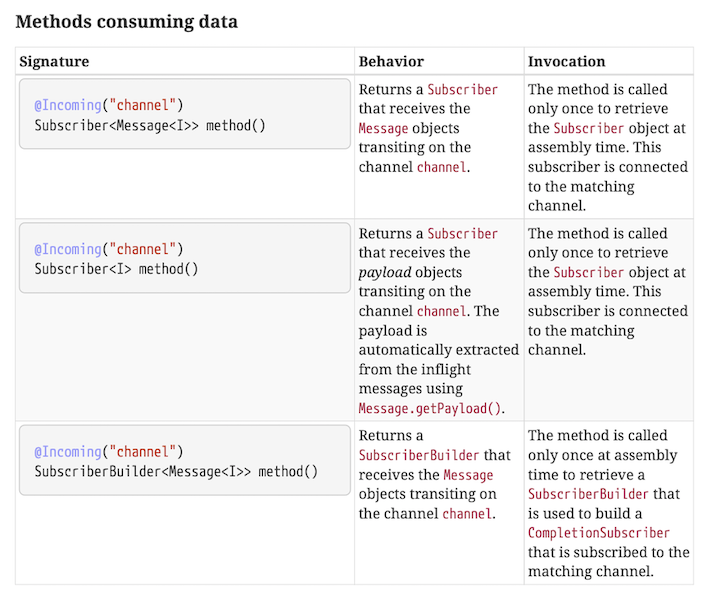

# Reactive Messaging


<!-- .slide: data-visibility="hidden" -->
## Learning outcomes

After this module, you should:
* Understand how Kafka is the Swiss Army Chainsaw of messaging.


## Microprofile Reactive Messaging Spec

Microprofile Reactive Messaging spécifie une annotation basée sur le modèle pour la création de microservice évenementiel.

Il y a deux annotations principales:

* `@Incoming` pour permettre à une méthode de _lire_ les messages à partir d’un _canal_.
* `@Outgoing` pour _écrire_ la valeur de retour d’une méthode dans un _canal_.


## Canaux, Messages et Accusé

Les canaux peuvent être _internes_, pour connecter différentes instances entre elles, ou _externes_, par exemple pour se connecter à Kafka. Dans Quarkus, cela est géré par la configuration.

Les messages sont les éléments produits et écrits sur les canaux. C'est une interface minimale qui ne contient que des méthodes pour récupérer le contenu et pour accuser réception du message.

Accuser réception du message signifie dire au producteur du message que nous l'avons traité avec succès et qu'il n'est pas nécessaire de le récupérer à nouveau.

Note:
A typical implementation (for example for Kafka) will have a richer class that extends `Message`, like `KafkaRecord`.

Une implémentation typique (par exemple pour Kafka) sera d’avoir une classe plus riche en étendant `Message`, comme `KafkaRecord`.


## Canaux internes

```java [|1-8|10-14|16-19|]
@Outgoing("greet-subjects")
public Multi<String> greetSubjectsProducer() {
    return Multi.createFrom()
            .ticks()
            .every(Duration.ofSeconds(1))
            .map(__ -> faker.name().fullName())
            .onOverflow().buffer(1);
}

@Incoming("greet-subjects")
@Outgoing("greets")
public String greetSubjectsConsumer(String subject) {
    return "Hello " + subject + "!";
}

@Incoming("greets")
public void greetPrinter(String greet) {
    System.out.println(greet);
}
```

Note:
* This requires no configuration. The channels 'match', both are mentioned once for incoming and once for outgoing, so it can be connected internally.
* The top one is a producer
* The middle one is a processor, consumes and produces
* The bottom one is a consumer


## Signatures

D’autres signatures sont supportées:

```java [|3-6|10|]
@Incoming("greet-subjects")
@Outgoing("greets")
public Multi<String> greetSubjectsConsumer(String subject) {
  return Multi.createFrom().items(
    "Hey " + subject + "!",
    "Ho " + subject + "!");
}

@Incoming("greets")
public CompletableFuture<Message<?>> greetPrinter(Message<String> greet) {
    System.out.println(greet.getPayload());
    return CompletableFuture.completedFuture(greet);
}
```

Note:
* In the first example, instead of a single message, we return a Multi. These get concatenated into the stream, so effectively this is a `flatMap` processor now.
* In the second example, we inject the full `Message` rather than only the payload. This would allow us to manually control acknowledging.

Note that in the second example, a `CompletionStage` is returned. This is needed, otherwise the implementation would have to block until `greetPrinter` is finished before it can `ack` the message. Now it can subscribe on the completion of the `CompletionStage` to acknowledge the message.


## Signatures

Toute les possibilités sont spécifiées dans la spécification de messagerie réactive de Microprofile:



Note:
* Cf. [MicroProfile Reactive Messaging Specification](https://download.eclipse.org/microprofile/microprofile-reactive-messaging-1.0/microprofile-reactive-messaging-spec.html)
* In the screenshot you see that a method that receives messages doesn't need to process the messages itself, it can also return a subscriber instance!


<!-- .slide: data-background="#abcdef" -->
## Exercise: Internal Channels


## Connexion à Kafka

Pour se connecter à Kafka au lieu de passer par des canaux internes, nous avons besoin de:

* L’extension `quarkus-reactive-messaging-smallrye-kafka`
* Configurer les Topics Kafka
* Configurer le désérialiseur et le sérialiseur


## Connexion à Kafka

``` [|1,4|1-3|4-6|]
mp.messaging.incoming.greets-in.connector=smallrye-kafka
mp.messaging.incoming.greets-in.topic=greets
mp.messaging.incoming.greets-in.value.deserializer=com.lunatech.training.quarkus.reactive.GreetDeserializer
mp.messaging.outgoing.greets-out.connector=smallrye-kafka
mp.messaging.outgoing.greets-out.topic=greets
mp.messaging.outgoing.greets-out.value.serializer=io.quarkus.kafka.client.serialization.ObjectMapperSerializer
```

```java
public class GreetDeserializer extends ObjectMapperDeserializer<Greet> {

    public GreetDeserializer() {
        super(Greet.class);
    }

}
```

Note:
* We configure the `smallrye-kafka` connector
* We need a custom GreetDeserializer (that just extends the generic one) just to have it return the right type
* We can use the generic serializer
* We need to configure *two* channels here, one incoming and one outgoing


## Stratégies d’erreur

Faire en sorte que notre consommateur produise des erreurs occasionnelles:
```java [|5-7|]
private int counter = 0;

@Incoming("greets-in")
public void greetPrinter(Greet greet) {
  if(++counter % 3 == 0) {
    throw new RuntimeException("Crashing on message for " + greet.subject);
  }

  System.out.println(greet.greet + " " + greet.subject);
}
```

This will cause the stream to terminate on the third message.

Note:
Every third message will crash.


## Stratégies d’erreur

Nous pouvons configurer ce comportement avec:

    mp.messaging.incoming.greets-in.failure-strategy=ignore

Avec ce réglage, il logguera une erreur, mais continuera avec le flux.

Note:
This can be useful in scenario's where we don't need to process every message per se.


## Stratégies d’erreur

Autre option:

    mp.messaging.incoming.greets-in.failure-strategy=dead-letter-queue

Ce changement vers une *queue dead letter*, permet à un autre système - ou une opération humaine - de monitorer ces messages, et éventuellement les reprogrammés.


## Stratégies de validation (Commit)

Kafka est un système de messagerie _at-least-once_. Pour indiquer à Kafka que vous avez traité avec succès un message, vous le validez (_commit_). Cela indiquera à Kafka que vous n'avez pas besoin de revoir ce message en particulier. Si vous ne validez pas de message, en cas de plantage et de redémarrage de votre application, vous verrez à nouveau le même message de Kafka.

SmallRye Reactive Messaging Kafka garde une trace de tous les accusés de réception des messages et, en fonction de cela, décide du moment de la validation.


## Stratégies de validation (Commit)

Supposons le connecteur passe les 8 message suivants à notre application et reçoit les accusés suivants:

1. Acknowledged
2. Acknowledged
3. Acknowledged
4. Nothing
5. Acknowledged
6. Acknowledged
7. Nothing
8. Nothing

Maintenant, il peut s'engager jusqu'au message n°3, car tout a été validé (commit) jusqu'au message numéro 3.

Note:
Ask the audience what happens after #3 gets committed, and then the application crashes and restarts?
Answer: All messages from 4 onwards are reprocessed.

Demandez au public ce qui se passe après la validation de n°3, puis l'application plante et redémarre? Réponse: Tous les messages à partir de 4 sont retraités


## Commit Strategies

Il y a trois stratégies de validation:

* Ignore
* Latest
* Throttled

Note:
* Ignore doesn't commit. Useful in combination with the 'auto commit' feature of the Kafka Client
* Latest commits as soon as a message is acknowledged. Could lead to a lot of commits, but minimizes reprocessing.

Also:
When using `throttled`, there's a maximum time the connector waits for an `ack` or a `nack`. By default one minute. If a message is not acked or nacked after a minute, the connector will mark the application as unhealthy.


<!-- .slide: data-background="#abcdef" -->
## Exercise: Kafka


<!-- .slide: data-background="#abcdef" -->
## Exercise: Dead Letter Queue & Stream filtering

Note:
- Tell students in final exercise they can add an @Incoming listener on the dead-letter-queue to print failures


<!-- .slide: data-visibility="hidden" -->
## Broadcasting


<!-- .slide: data-visibility="hidden" -->
##

TODO:
- Message acknowledgement
- Message<T> instead of <T>
- Supporting multiple subscribers (broadcasting)
- Injecting publisher or multi
- Dead letter queue
- Health & Metrics integration


<!-- .slide: data-visibility="hidden" -->
## Recap

In this module we have:
*
