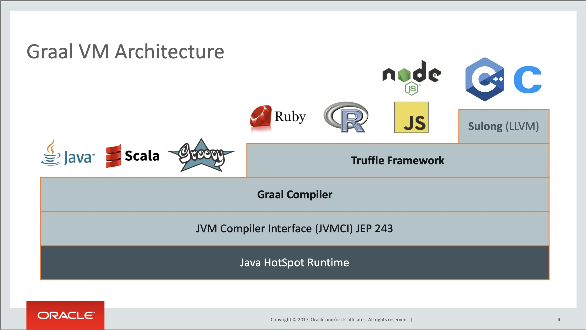

# GraalVM


## Connaissances obtenues

Après ce module, vous devrez savoir :
* Ce qu'est GraalVM et son rôle
* Compiler une application en exécutable natif
* Déboguer un exécutable natif


## Introduction

GraalVM est une distribution JDK permettant d'optimiser les applications en langages JVM (Java, Scala, ...) et prend aussi en charge d'autres langages tels que JavaScript ou Python par exemple.

GraalVM peut donc mélanger plusieurs langages de programmation en une seule application tout en éliminant les coûts d'appels externes.

Note:
* GraalVM accroit de l'ordre de 32% en moyenne les performances des applications Java


## Fonctionnalités

* Graal Compiler
* GraalVM Native Image
* Truffle Language Implementation Framework et GraalVM SDK
* LLVM Runtime et JavaScript Runtime

Note:
* Graal Compiler, nouveau compilateur JIT pour Java
* GraalVM Native Image permettant la compilation AOT -> compilation directe du code Java en code machine
* Truffle Language Implementation Framework et GraalVM SDK fournissant des environnement d'exécution pour d'autres langages de programmation
* LLVM Runtime et JavaScript Runtime, environnement d'exécution pour LLVM et JavaScript
* Possibilité d'installer d'autres langages et de définir le nôtre


## Architecture



## Distributions de GraalVM

3 distributions :
* Oracle GraalVM Community Edition (CE)
* Oracle GraalVM Enterprise Edition (EE)
* Mandrel


## Mandrel

Distribution dont l'objectif principal est de fournir un moyen de créer des exécutables natifs spécialement conçus pour prendre en charge Quarkus et qui ciblent les environnements conteneurisés Linux.

Les versions de Mandrel sont construites à partir d'une base de code dérivée de la base de code Oracle GraalVM CE, avec seulement des modifications mineures mais quelques exclusions importantes qui ne sont pas nécessaires pour les applications natives Quarkus.


## Compilation d'un exécutable natif

La compilation se fait avec cette commande :

```
./mvnw package -Pnative
```


## Débogage d'un exécutable natif

```
./mvnw verify -Pnative
```


## Affichage complet des erreurs

* Dans le fichier pom.xml, ajouter dans la configuration `<trimStackTrace>false</trimStackTrace>`

```xml
<artifactId>maven-failsafe-plugin</artifactId>
<version>${surefire-plugin.version}</version>
<configuration>
  <trimStackTrace>false</trimStackTrace>
</configuration>
```


## Tester sans recompiler

Pour relancer les tests sans compiler une nouvelle fois avec un exécutable existant

```
./mvnw test-compile failsafe:integration-test
```


## Performances

Dans le cas de cette formation :

_Sans native-image executable_
```text
Temps de démarrage  entre 3 et 3.5 secondes
Mémoire utilisée    env. 530M
```

_En native-image executable_
```text
Tempas de démarrage entre 0.07 et 1.2 seconde
Mémoire utilisée    env. 52M
```


<!-- .slide: data-background="#abcdef" -->
## Exercice: Utiliser Graal VM


## Recap

Au cours de ce module, nous avons :
* Appris ce qu'est Graal VM et son rôle
* Compilé une application en exécutable natif
* Débogué un exécutable natif