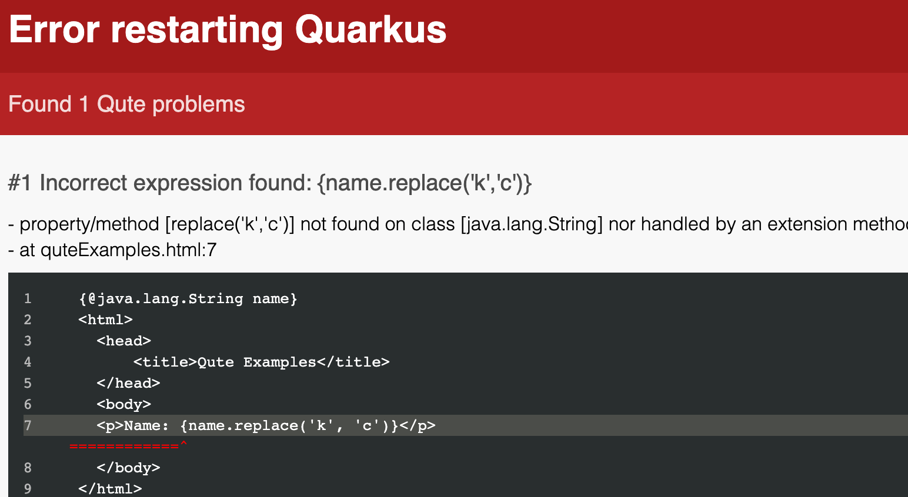

# Qute


## Qute Template Engine

Quarkus comes with a template engine named *qute*:

* Simple syntax
* Minimized reflection usage
* Optionally type-safe
* Output can be streamed

Note:
* Minimizing reflection reduces the size of the native image.
* Optionally type-safe: we'll see this in later slides
* Output can be streamed: Uses HTTP chunking to reduce required memory.


## Qute Expressions

Given a class `Product`:
```java
public class Product {
    public String name;
    public BigDecimal price;
}
```

This is a template rendering the product details:
```html
<html>
  <head>
    <title>{product.name}</title> 
  </head>
  <body>
    <h1>{product.name}</h1>
    <div>Price: {product.price}</div> 
  </body>
</html>
```


## Qute iterations

You can iterate over collections:

```html
<ul>
{#for product in products}
  <li>{product.name}</li>
{/for}
</ul>
```


## Some Qute operators

Qute has some useful operators:

```html [|1|2|3|5|6|]
Manufacturer: {product.manufacturer ?: 'Unknown'}
Manufacturer: {product.manufacturer or 'Unknown'}
Available: {product.isAvailable ? 'Yep' : 'Nope' }

{product.isAvailable && product.isCool}
{product.isAvailable || product.isCool}
```

Note:
* First two lines are _Elvis operator_, resolve to the default value if the previous part cannot be resolved or resolves to null
* Third line is the _ternary operator_.


## Qute Usage

```java [|1-2|6|8|]
@Inject 
Template productDetails;

@GET
@Path("{productId}")
public TemplateInstance product(@PathParam("productId") long productId) { 
  Product product = Product.findById(productId);
  return productDetails.data("product", product);
}
```

1. Inject a template. Quarkus derives the template file name from the field name.
2. Resource method returns a `TemplateInstance`. RESTeasy knows how to convert this to a response.
3. Populate the template with data to create a `TemplateInstance`.


## Exercise #2: A Qute Hello World

Enhance your Hello World application with an HTML template that renders the message.

* Create a file `src/main/resources/....html` // TODO
* Populate it with some HTML and use an expression `{message}`
* Inject it into your `Resource` class as a `Template`.
* Make your `Resource` method return a `TemplateInstance`
* Create the `TemplateInstance` using the `data` method on the `Template`
* Observe your wonderful new Hello World :-)


## Qute Template Engine

What does Quarkus do?

* Compile the template into // TODO

How does it work in native mode?

* How does it work? // TODO


## Qute Virtual Methods

Qute allows you to call _virtual methods_ on values. They are called _virtual_ because they don't correspond to real methods on the Java value, but to 

```html [|1|2-3]
<p>Name: {name}</p>
<p>Name: {name.toUpperCase()}</p>
<p>Name: {name.toUpperCase}</p>
```

Note:

* `toUpperCase` is a nullary method on Java's String. We can call that, with or without parentheses


## Qute Virtual Methods

```java [|1|3-9|]
@TemplateExtension
public class StringExtension {
    public static String shout(String in) {
        return in + "!";
    }

    public static String shout(String in, String append) {
        return in + append;
    }
}
```

```html [|1|2|3|]
<p>Name: {name.shout}</p>
<p>Name: {name.shout('!!!')}</p>
<p>Name: {name shout '!!!'}</p>
```

Note:
* `shout` is a virtual method. In fact there are two virtual methods, with and without parameters
* In the last line, we use infix notation


## Qute Virtual Methods 

We can't call _real_ methods with parameters out of the box:

    <p>Name: {name.replace('k', 'c'}}</p>

Will print:

    <p>Name: NOT_FOUND</p>


## Qute Virtual Methods - Template Data

But we can instruct Qute to generate a _value resolver_ for us:

    @TemplateData(target = String.class)

Now this works as expected:

    <p>Name: {name.replace('k', 'c'}}</p>

Note:
// TODO, explain value resolvers a bit more.


## Type safe templates

In the previous example we saw that the following line:

     <p>Name: {name.replace('k', 'c'}}</p>

printed `NOT_FOUND`, at run time. We can improve on this, and make Qute generate an error at build time, by indicating in the template that we expect a value of type `String`:

```html [|1,7|]
{@java.lang.String name}
<html>
  <head>
      <title>Qute Examples</title>
  </head>
  <body>
  <p>Name: {name.replace('k', 'c')}</p>
  </body>
</html>
```


## Type safe templates

Now, Qute will render an error:




// TODO, explain the two methods of making template type-safe.
// TODO, demonstrate a typing error in a template and the error Quarkus gives.
// TODO, explain why the 'native' keyword is used in Java


## Exercise #3: Qute products, part 1

Now that we know some Quarkus, and some Qute, we will start on the HIQUÉA catalog!

You can find some templates you can use in the directory // TODO, or you can come up with your own templates :)

TODO, tell people how to get the Product class, and how to get some sample products.

* Create an endpoint that lists all products, using Qute
* Use a custom tag for each product in the list


## Exercise #3, Qute products, part 2

Create a 'details' page that shows the details of a product

* Use a path parameter for the product identifier

// TODO, work out the details


# Namespaces

// TODO, tell a bit about namespaces
// TODO, give an example where we use a namespace to inject info about the current request into a template?


# Summary

// TODO, explain again why Qute is created
// TODO, custom tags
// TODO, include / insert templates
