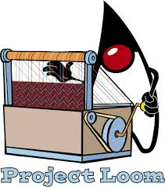

# Reactive Programming


<!-- .slide: data-visibility="hidden" -->
## Learning outcomes

After this module, you should:
* Understand how Kafka is the Swiss Army Chainsaw of messaging.


## Execution Model

When using the standard *imperative* RESTEasy, Quarkus creates as many `executor` threads as needed, up to the configured maximum:

```java [|6|]
@GET
@Path("/slow")
public String slow() throws InterruptedException {
    String thread = Thread.currentThread().getName();
    System.out.println("Thread: " + thread);
    Thread.sleep(1000);
    return thread;
}
```

``` [|1|8|]
ab -c 50 -n300  http://127.0.0.1:8081/threads/slow
...
Connection Times (ms)
              min  mean[+/-sd] median   max
Connect:        0    0   0.7      0       3
Processing:  1002 1009   6.8   1007    1037
Waiting:     1002 1009   6.8   1007    1037
Total:       1002 1010   7.4   1007    1039
```

The default maximum is `max(200, 8 * nr_of_cores)`

Note:
What we see here, is that if we execute 50 concurrent requests, they all get executed in parallel.


## Execution Model

If we choose a smaller amount of maximum threads:

```quarkus.thread-pool.max-threads=10```

Then running the same `ab` command takes much longer:

``` [|8|]
ab -c 50 -n300  http://127.0.0.1:8081/threads/slow
...
Connection Times (ms)
              min  mean[+/-sd] median   max
Connect:        0    0   0.5      0       2
Processing:  1020 4679 959.9   5021    5068
Waiting:     1020 4679 960.0   5020    5068
Total:       1022 4680 959.5   5021    5070
```

Note:
What we see here, is that if we reduce the maximum number of threads, we see that many requests have to wait before being processed.


## Execution Model - Blocking Threads

Two types of a thread being held up:

* Doing useful work on the CPU
* Waiting for somebody else (Database, API call, Disk IO, etc.). This is what we call _blocking_.

Note:
Explain the following:
* Doing useful work on the CPU is good. It's what we have it for. If all CPU's are busy doing useful work, we have great utilization of our resources, and we can be happy.
* Waiting for others is fine, it's a fact of life. But it means we need to be *doing something else* with the CPU.

So suppose we have 4 cores, and 10 threads. If 5 threads are actively computing stuff, and 5 threads are blocked, there's no problem. But if 8 threads are blocked, and only 2 doing useful CPU work, it ís a problem.

That's why Quarkus makes sure there's a royal amount of threads: at least 200 in the default config. So we can have at least 200 concurrent requests.

But there is a limitation: Quarkus can't discriminate between a thread blocked on CPU, and a thread blocked on IO. If all 200 threads are used for CPU, it will cause _thread starvation_: the computation doesn't make much progress, because a thread is scheduled only occasionally.

In the next chapter, we will see a different model that solves this.


## CPU vs Non-Blocking IO vs Blocking IO

Remember from last section:

* A thread doing CPU is good, but we don't want a ton of those
* A thread doing IO is fine, but it shouldn't prevent other threads doing CPU work

<div class="fragment">
Solution?

<ul>
<li> Have a limited number of threads doing CPU-work
<li> Try to do IO without blocking a thread
<li> If you can't, have potentially an unlimited number of threads waiting for IO
</ul>
</div>


## RESTEasy Reactive

The `quarkus-resteasy-reactive` extension brings reactive JAX-RS support to Quarkus.

```xml
<dependency>
  <groupId>io.quarkus</groupId>
  <artifactId>quarkus-resteasy-reactive</artifactId>
</dependency>
```

```java
@GET
@Path("/hello")
public String hello() {
  return "Hello World";
}
```

Works identically.


## RESTEasy Reactive

The `quarkus-resteasy-reactive` extension brings reactive JAX-RS support to Quarkus.

```xml
<dependency>
  <groupId>io.quarkus</groupId>
  <artifactId>quarkus-resteasy-reactive</artifactId>
</dependency>
```

```java [|4|]
@GET
@Path("/hello")
@Produces(MediaType.TEXT_PLAIN)
public CompletionStage<String> hello() {
  return CompletableFuture.completedFuture("Hello!");
}
```

We can also return a `CompletionStage`


## Reactive Execution Model

RESTEasy reactive **does** care about blocking

* Your method will be called by a Vert.x eventloop thread
* You shouldn't block it
* If you do block, annotate with `@Blocking`


## Reactive Execution Model

### Example

```java
@GET
@Path("/regular")
public String regular() {
  return Thread.currentThread().getName();
}
```

This is fine - returns something like `vert.x-eventloop-thread-3`


## Reactive Execution Model

### Bad Example

```java [|4|]
@GET
@Path("/regular-slow")
public String regularSlow() {
  Thread.sleep(1000);
  return Thread.currentThread().getName();
}
```

This is **not** fine.

Note:
Here we block the eventloop thread for IO. Ask the audience what they expect to happen if we measure this with a high number of concurrent requests?

See next page for the results


## Reactive Execution Model

### Bad Example

``` [|1|8|9-10|]
ab -c50 -n300  http://127.0.0.1:8082/threads/regular-slow

Connection Times (ms)
min  mean[+/-sd] median   max
Connect:        0    1   0.7      0       3
Processing:  1005 2013 402.7   2012    3087
Waiting:     1005 2012 402.7   2012    3087
Total:       1007 2013 402.3   2013    3088
WARNING: The median and mean for the initial connection time are not within a normal deviation
These results are probably not that reliable.
```

Note:
Ask the audience if they can guess how many IO threads quarkus has out of the box?

Answer:
* We run 50 requests concurrently, and you see that the slowest take 3 seconds. This gives us between 17 and 24 threads to get this behaviour.
* According to the Quarkus docs, it's twice the number of cores.
* This measurement was done on 6 cores with hyperthreading, so effectively 12 cores and 24 IO threads. We guessed correctly!

Also note that AB finds the results suspicious :)


## Reactive Execution Model

### Good Example

```java [|2|]
@GET
@Path("/regular-slow")
@Blocking
public String blockingSlow() {
  Thread.sleep(1000);
  return Thread.currentThread().getName();
}
```

This returns `executor-thread-221`

Note:
And remember, of these threads there are very many, and you can safely tie them up in blocking IO.


## Reactive Execution Model

### Good Example

```
ab -c70 -n300  http://127.0.0.1:8082/threads/blocking-slow

Connection Times (ms)
              min  mean[+/-sd] median   max
Connect:        0    1   0.7      1       3
Processing:  1001 1008   4.5   1007    1023
Waiting:     1001 1008   4.5   1007    1023
Total:       1001 1009   4.9   1008    1024
```

Back to normal :)

Note:
Here we see that if we tell quarkus that our method is blocking, it will run it with an executor thread; of which there are many more available.


## Reactive Execution Model

### Even better example

Of course, we can do even much better, by not blocking a thread at all:

```java [|3|5|6-7|]
@GET
@Path("/nonblocking-slow")
public Uni<String> nonblockingSlow() {
  return Uni.createFrom().item(Thread.currentThread().getName())
    .onItem().delayIt().by(Duration.ofSeconds(1))
    .onItem().transform(i ->
      "Initial: " + i + ", later: " + Thread.currentThread().getName());
}
```

Outputs:
    Initial: vert.x-eventloop-thread-18, later: executor-thread-1

Note:
This demonstrates asynchronous 'waiting'. No thread is blocked here. The initial part of the computation is performed on the Vert.x IO thread. The `delayIt` method doesn't block, just returns a `Uni` that completes after the specified time. Continued work with that `Uni` is not performed by an IO Thread.


## Reactive Routes

An alternative to _RESTEasy Reactive_ is to use the _Reactive Routes_ extension:

> Reactive routes propose an alternative approach to implement HTTP endpoints where you declare and chain routes. This approach became very popular in the JavaScript world, with frameworks like Express.Js or Hapi. Quarkus also offers the possibility to use reactive routes. You can implement REST API with routes only or combine them with JAX-RS resources and servlets.

Note:
This extension is also known as 'Vert.x web'


## Reactive Routes

```java [|1-5|7-10|12-16|]
@Route(methods = HttpMethod.GET)
void hello(RoutingContext rc) {
    rc.response().end("hello");
}

@Route(path = "/hello")
Uni<String> hello(RoutingContext context) {
  return Uni.createFrom().item("Hello world!");
}

@Route(produces = "application/json")
Person createPerson(@Body Person person, @Param("id") Optional<String> primaryKey) {
  person.setId(primaryKey.map(Integer::valueOf).orElse(42));
  return person;
}
```

Note:
1. No path or regex set, path derived from the method name! Shows working with the `RoutingContext`, which is a Vert.x class.
2. Shows returning a Uni instead of putting the response on the `RoutingContext`
3. Shows parameter usage

Also:
Instead of injecting `RoutingContext` you can also choose some other Vert.x or Quarkus or even Mutiny HTTP model classes. Just pick one that you like working with or that has the stuff you need easily available.

How to choose between this and RESTEasy Reactive?
- RESTEasy Reactive is _experimental_ as of February 2021
- Vert.x Web is stable, so typically a better choice.


# Reactive Database Access


## About JDBC

JDBC is a blocking API

Example:

    ResultSet rs = stmt.executeQuery(query);

There is **no way** to obtain the `ResultSet` without blocking **a** thread.

Note:
Remark that you don't necessarily have to block the thread you're working on. Of course you can execute the call on some different thread, and obtain a `CompletionStage` here. But then you have to block that other thread!

Of course it's not a huge problem in most applications, for several reasons:
- Databases don't like thousands of concurrent queries, so we'd probably queue requests anyway if we have many of them
- As shown, Quarkus can deal quite will with a relatively large amount of threads that are okay to block on IO
- For big apps, the overhead of several tens of threads for this isn't huge

But for *supersonic* *subatomic* we can do better!


## Hibernate going Reactive

In December 2020, Hibernate Reactive was launched:

```java
Uni<Book> bookUni = session.find(Book.class, book.id);
bookUni.invoke( book -> System.out.println(book.title + " is a great book!") )
```

It's a reactive API for Hibernate ORM.


## Hibernate going Reactive

* Works with non-blocking database clients. Currently the Vert.x clients for Postgres, MySQL and DB2
* Well-integrated with Quarkus
* No implicit blocking lazy loading, but explicit asynchronous operations for fetching associations

Note:
One other thing to mention, the creators _don't expect this to be faster than regular Hibernate ORM_. They don't expect many applications to benefit from it. However, they do expect better degradation under load for some applications, and maybe there will be performancee improvements in the future.


## Hibernate Reactive + Panache

* Methods that returned `T` or `List<T>` now return `Uni<T>` and `Uni<List<T>>`
* New methods `streamXXX` that return a `Multi<T>`
* Classes live in a new package under `io.quarkus.hibernate.reactive`


## Hibernate Reactive + Panache usage

```java
@GET
public Multi<Product> products() {
    return Product.streamAll();
}

@GET
@Path("{productId}")
public Uni<Product> details(@PathParam("productId") Long productId) {
    return Product.findById(productId);
}
```

Note:
* Here we modified the `products` endpoint to use a `streamXXX` method of Hibernate, to get a `Multi`
Remark the difference between `Uni<List<T>>` and `Multi<T>`: The `Uni<List<T>>` will get the List into memory, while the Multi is fully streaming.


## Mutiny, Uni & Multi

**Mutiny** is the library for Reactive Programming that Quarkus uses. It's two main types are:

- `Multi<T>` represents a stream of items of type `T`
- `Uni<T>`, represents a stream of zero or one element of type `T`

Note:
* Mention that Multi is potentially unbounded
* Mention that they also support indicating failure.
* Mention that we *will learn much more about these types in later slides*
* Mention that Hibernate Reactive has two APIs: one using Mutiny types and one using Java Stdlib types: `CompletionStage` and `Publisher`.


## RESTEasy Reactive with Mutiny Uni

`Uni`s are supported as a result type:
```java [|3|4]
@GET
@Produces(MediaType.TEXT_PLAIN)
public Uni<String> helloUni() {
    return Uni.createFrom().item("Hello!");
}
```

Note: Again, a `Uni` is like a stream that emits up to one element. But it can also be cancelled or fail.


## RESTEasy Reactive

Also, `Multi` is supported:

```java
@GET
@Produces(MediaType.TEXT_PLAIN)
public Multi<String> helloMulti() {
  return Multi.createFrom().items("Hello", "world!");
}
```

This returns a `chunked` HTTP response.

Note: Meaning that Quarkus doesn't need to create the full response in memory before sending it.

So it can support arbitrarily long HTTP responses in bounded memory.


<!-- .slide: data-background="#abcdef" -->
## Exercise: Going Reactive


## Sessions & Transactions

```java
session.find(Product.class, id)
    .call(product -> session.remove(product))
    .call(() -> session.flush())
```

Note:
- The major point to make here is that 'sessions' and 'transactions' aren't bound to threads anymore, but need to be explicitly handled.
- Of the Hibernate Session, there are also multiple variants available; one for Java standardlib types, and one for Mutiny types!
- These are examples without Panache, using Hibernate directly


## Sessions & Transactions - Example

Good:
```java
Uni<Product> product = session.find(Product.class, id)
    .call(session::remove)
    .call(session::flush)
```

Bad:
```java
Uni<Product> product = session.find(Product.class, id)
    .call(session::remove)
    .invoke(session::flush)
```

Methods:
```java
Uni<T> call(Supplier<Uni<?>> supplier)
Uni<T> invoke(Runnable callback)
```

Both examples compile and have the right types, but the second one _will never execute the flush_.

Note:
* This shows a common mistake. Both of these examples compile, but the second one _will never execute the flush_.

This is because `call` expects a `Uni`, _and subscribes to it_ when the 'outer' `Uni` (containing the product) is subscribed to, even through the _result_ of the Uni created by Flush is ignored.
But `invoke` never subscribes to the `Uni` returned by `invoke`.

People familiar with reactive programming will have experienced this before typically!


## Low-level Reactive SQL Clients

Another way of connecting to the DB is using the low-level reactive SQL clients.
```
PgConnectOptions connectOptions = new PgConnectOptions()
  .setPort(5432)
  .setHost("the-host")
  .setDatabase("the-db")
  .setUser("user")
  .setPassword("secret");

// Pool options
PoolOptions poolOptions = new PoolOptions()
  .setMaxSize(5);

// Create the client pool
PgPool client = PgPool.pool(connectOptions, poolOptions);
```

The base object we need is a `PgPool` instance.

Note:
^ Remark that in Quarkus, *of course* we can just configure it in the unified config, so this is not needed.


## Low-level Reactive SQL Clients

```
@Inject
PgPool client;
```

Pick the right `PgPool`:
* `io.vertx.mutiny.pgclient.PgPool` uses Mutiny types
* `io.vertx.pgclient.PgPoool` uses Vert.x types

Note:
There are created with a code generator. There are also variants for RxJava 2 and RxJava 3. But when using Quarkus, sticking with the Mutiny variants is certainly your best option.


## Querying

Querying returns a `Uni` containing a `RowSet`:

    Uni<RowSet<Row>> rowSetUni = client.query("SELECT name, age FROM people").execute();

Of course, we can transform this into a `Multi` of `Rows`:

    Multi<Row> people = client.query("SELECT name, age FROM people").execute()
        .onItem().transformToMulti(set -> Multi.createFrom().iterable(set));


## Querying

```java
Multi<Person> people = client.query("SELECT name, age FROM people")
  .execute()
  .onItem().transformToMulti(rows -> Multi.createFrom().iterable(rows))
  .onItem().transform(Person::fromRow);
```

```java
static Person fromRow(Row row) {
  return new Person(row.getString("name"), row.getInteger("age"));
}
```

Note:
Explain how `onItem` and `transform` are just regular Mutiny methods
Explain that `RowSet` is an iterator that reads from the DB when requested.

Explain how we can utilize a static method on Person and a method reference to cleanly map from a `Row` to a `Person`


## Parameters

```java [|1|2|3|]
client.preparedQuery(
    "SELECT id, name FROM fruits WHERE id = $1")
    .execute(Tuple.of(id))
```

Note:
Explain that this `Tuple` comes from Mutiny.


## Inserts and Updates

```java [|1|2|3|4|]
  Uni<Long> personId = client
    .preparedQuery("INSERT INTO people (name, age) VALUES ($1, $2) RETURNING id")
    .execute(Tuple.of(name, age))
    .onItem().transform(pgRowSet -> pgRowSet.iterator().next().getLong("id"));
}
```

Note:
Explain that we retrieve back the generated Id from the database.


<!-- .slide: data-background="#abcdef" -->
## Exercise: Reactive search endpoint


## Listen & Notify

One of the cool features of Postgres is to `Listen` to channels. As part of transactions you can notify channels, for example to alert consumers that are waiting for event.

Note:
This lends itself very well for reactive programming: keep a connection open to Postgres, have a stream of subscriptions/unsubscribes going there, and a stream of notifications coming back.


## Listen & Notify

```java
@Path("/listen/{channel}")
@GET
@Produces(MediaType.SERVER_SENT_EVENTS)
@RestSseElementType(MediaType.APPLICATION_JSON)
public Multi<JsonObject> listen(@PathParam("channel") String channel) {
  return client.getConnection()
    .onItem().transformToMulti(connection -> {
      Multi<PgNotification> notifications = Multi.createFrom().
        emitter(c -> toPgConnection(connection).notificationHandler(c::emit));
      return connection.query("LISTEN " + channel).execute().onItem().transformToMulti(__ -> notifications);
    }).map(PgNotification::toJson);
}
```

```java
@Path("/notify/{channel}")
@POST
@Produces(MediaType.TEXT_PLAIN)
@Consumes(MediaType.WILDCARD)
public Uni<String> notif(@PathParam("channel") String channel, String stuff) {
    return client.preparedQuery("NOTIFY " + channel +  ", $$" + stuff + "$$").execute()
            .map(rs -> "Posted to " + channel + " channel");
}
```

Note:
First image shows `LISTEN`, we start listening to a Postgres _channel_. Every notification for that channel ends up in the Multi, so will be observed by someone who connects to the SSE endpoint.

Of course, like this we make a new connection per customer that connects. Ask the audience; what could we do to make this better? Answer: broadcast.

Second image shows how we `NOTIFY`


## Listen & Notify

```shell
➜ http localhost:8082/db/listen/milkshakes --stream
HTTP/1.1 200 OK
Content-Type: text/event-stream
X-SSE-Content-Type: application/json
transfer-encoding: chunked

data:{"channel":"milkshakes","payload":"{\"flavour\": \"banana\"}","processId":57}

data:{"channel":"milkshakes","payload":"{\"flavour\": \"strawberry\"}","processId":58}
```

```shell
➜ http POST localhost:8082/db/notify/milkshakes flavour=banana
HTTP/1.1 200 OK
Content-Type: text/plain
content-length: 28

Posted to milkshakes channel

➜ http POST localhost:8082/db/notify/milkshakes flavour=strawberry
HTTP/1.1 200 OK
Content-Type: text/plain
content-length: 28

Posted to milkshakes channel
```

Note:
First screenshot show connecting to the RESTful SSE 'listen' endpoint with path param 'milkshakes'.

Second screenshot shows posting messages to the 'notify' endpoint with path param 'milkshakes' and a request body.

In the first screenshot you see those come in.

TODO, maybe prepare a little demo for this?


<!-- .slide: data-background="#abcdef" -->
## Exercise: Listen & Notify

Note:

Different ways to fill in the missing part

```java
.onItem().transformToMulti(rows -> Multi.createFrom().iterable(rows))
.map(Product::from)
```

```java
.toMulti().flatMap(rows -> Multi.createFrom().iterable(rows))
.map(Product::from)
```

```java
.onItem().<Row>disjoint()
.map(Product::from)
```


<!-- .slide: data-visibility="hidden" -->
## What's looming on the horizon?



Note:
Explain a bit about Project Loom:
- Upcoming changes to the JDK, to support _virtual threads_, aka fibers, threads that don't consume an OS thread and thus don't suffer from the memory-overhead and poor cache behavior of regular threads. With Loom it is possible to create millions of virtual threads!
- Loom will make most existing JDBC drivers suddenly non-blocking, because all networking API's will be reimplemented in a non-blocking fashion. User code won't have to change
- Game changer for many applications, but also quite far away. Unlikely to make the Java 17 LTS, so maybe the first LTS that has it will be Java 23, due in 2024, so used at a company near you in 2026...


# Reactive Streams


## Reactive Streams

*Streaming data* is frequently found in modern applications:

- Events that flow from a system to consumers
- Records that flow from a database into a chunked HTTP response
- Messages that are consumed from a queue, transformed and put on another queue

<p class="fragment">A fundamental problem of streaming data systems, is to make sure that the <em>consumer</em> of the stream
can handle the messages that are being sent to it.</p>


## Slow consumer

Suppose you have a system that reads records from a database, transforms them to JSON and stores them in a file.

*Question:* What happens if you read 1000 records per second, but you can only write 500 per second to files?

Note:
Answer: memory will fill up, until the system breaks.


<!-- .slide: data-visibility="hidden" -->
## Slow consumer

Note:
TODO, draw diagram of slow consumer being overloaded by fast producer


## Slow consumer - solutions

Possible solutions:
* <!-- .element: class="fragment" -->Have a really fast consumer instead
* <!-- .element: class="fragment" -->Have a really slow producer
* <!-- .element: class="fragment" -->Have more memory than your database size
* <!-- .element: class="fragment" -->Adapt the speed of the producer, based on the capacity of the consumer

Note:
That last one is essentially what's called back-pressure. The consumer can indicate how much it wants to read.


## Back pressure

*Back pressure* means that the consumer can indicate *demand* to the producer. The producer will only produce the amount that the consumer requested.

Note:
TODO, draw diagram of a consumer indicating demand.


## Back pressure

* Works for the entire stream, not just the consumer at the end
* Each element can adapt the demand that's sent upstream
  - Slow components reduce demand
  - Some components, like buffers, can increase demand


## Streaming across TCP

* TCP natively supports back-pressure!
* *ack* messages contain a *window* field, indicating how much the sender may send.
* When the receiver processed data, a new *ack* gets sent, with a bigger window.

Note:
So we can make reactive back-pressuring systems across TCP. For example using chunked HTTP responses.


<!-- .slide: data-visibility="hidden" -->
## Compared with JMS

* Blocking interface: we don't want a blocking interface
* Asynchronous interface: no back pressure


## The Reactive Streams standard

Around 2013, engineers from Netflix, Pivotal, Lightbend, Twitter and others were all working on streaming systems, essentially solving the same issues.

To make sure their libraries would be interoperable, they came up with the **Reactive Streams** standard.

It's a minimal interface needed to connect streaming libraries, retaining full non-blocking operation and back-pressure and a shared cancellation and error model.


## The Reactive Streams standard

Ended up into the Java Standard Library as of Java 9, under `java.util.concurrent.Flow`.

Note:
The standard itself is very small, you can't really program against it directly. For example, ther are no `map` or `filter` methods in the standard library.

So you need to use an *implementation* of the standard, to do meaningful streaming work.


## Reactive Streams implementations

* Akka Streams
* RxJava
* Reactor
* Vert.x
* Mutiny
* ... and others

Note: Mutiny is the one that Quarkus uses. It's part of Smallrye. We've already used it in the DB section.

But some parts of the Vert.x implementation are also used, since Quarkus uses Vert-x as well.


## Getting Started

```java [1|2|3|4]
Multi<String> greeter = Multi.createFrom().items("Hello", "world");
Uni<List<String>> out = greeter.collectItems().asList();
List<String> results = out.subscribe().asCompletionStage().join();
System.out.println(results);
```

Note:
Explain this line by line:
1. We create a *Multi*. A Multi is stream, parameterized by the element type. This particular one is for a *bounded* stream. We know how many elements ther are. But the abstraction is the same. A `Multi` can also be unbounded.
2. We accumulate the elements into a List. As this is all non-blocking and async, it can't return this List as is, but it returns it into a `Uni`. A Uni is a special stream with one element. It's quite similar to a `CompletableFuture`. Note that at this point, the stream hasn't started yet!
3. Subscribe starts the stream, and `asCompletionStage` transforms the Uni into a `CompletableFuture`, which we then block on using `join`.
4. Finally we print the results.

Obviously, this is for demo purposes. In real code, you should almost never use *join*. Instead, the frameworks we work with (like Quarkus), support returning Uni's and Multi's.


## Mutiny Uni

A `Uni` only gets executed when connected to a *subscriber*:

```java [1-6|8-9]
Uni<Integer> myUni = Uni.createFrom().item(() -> {
    System.out.println("Creating the item!");
    return 5;
});

// Nothing has been printed at this point

System.out.println("Subscribing:");
myUni.subscribe().with(System.out::println); // Prints 'Creating the item!' and '5'
```

Note:
This is different from a `CompletionStage`, which is already running.

A `Uni` is more a descriptor of an operation.


## Mutiny Multi

Mutiny's `Multi` interface *extends* `org.reactivestreams.Publisher<T>`, so it's a reactive stream.

Multi has many methods to operate on it:

```java [1|2|3|4|5]
return Multi.createFrom().items("One", "Two", "Three", "Four", "Five", "Six")
        .map(String::toUpperCase)
        .filter(s -> s.length() >= 4)
        .flatMap(s -> Multi.createFrom().items(s.toCharArray()))
        .map(String::valueOf);
```

Note:
1. There many methods to *create* a Multi: From elements, from iterators, by imperatively pushing them in, from timer ticks. However, most typically as an application builder you won't create your own multi's, but obtain a multi from a library, like a Kafka connector, a Database connector, a web service client, a form upload, and transform that Multi.
2. The `map` method. Familiar from streams.
3. The `filter` method. Familiar from streams.
4. The `flatMap' method. To flatten nested Multi's.
5. Another `map`

There are many more, see the docs. Be aware; Quarkus uses a somewhat outdated Mutiny version sometimes.


## Mutiny Multi

A subscriber to a Multi, must deal with the following situations:

* An element arrives
* A failure occurred
* The (bounded) stream completed

```java [|3|4|5]
Cancellable cancellable = multi
.subscribe().with(
  item -> System.out.println(item),
  failure -> System.out.println("Failed with " + failure),
  () -> System.out.println("Completed"));
```

Note: If you check the Reactive Streams spec, this is also what you see.


## Visualising the events

```java [|1|2|3|4|5|6|7|8]
Multi.createFrom().items(1,2,3)
.onSubscribe().invoke(() -> System.out.println("⬇️ Subscribed"))
.onItem().invoke(i -> System.out.println("⬇️ Received item: " + i))
.onFailure().invoke(f -> System.out.println("⬇️ Failed with " + f))
.onCompletion().invoke(() -> System.out.println("⬇️ Completed"))
.onCancellation().invoke(() -> System.out.println("⬆️ Cancelled"))
.onRequest().invoke(l -> System.out.println("⬆️ Requested: " + l))
.subscribe().with(__ -> {}); // Drain
```

This prints the following:
``` [|1|2|3-5|6]
⬇️ Subscribed
⬆️ Requested: 9223372036854775807
⬇️ Received item: 1
⬇️ Received item: 2
⬇️ Received item: 3
⬇️ Completed
```

Note:
Explain every line

What's going on here?

What we see is that the `with` method requests Long.MaxValue elements. Basically, it's a subscriber that doesn't ever apply back-pressure!


## Visualising the events

```java [|8-10]
Stream<Integer> out = Multi.createFrom().items(1,2,3)
        .onSubscribe().invoke(() -> System.out.println("⬇️ Subscribed"))
        .onItem().invoke(i -> System.out.println("⬇️ Received item: " + i))
        .onFailure().invoke(f -> System.out.println("⬇️ Failed with " + f))
        .onCompletion().invoke(() -> System.out.println("⬇️ Completed"))
        .onCancellation().invoke(() -> System.out.println("⬆️ Cancelled"))
        .onRequest().invoke(l -> System.out.println("⬆️ Requested: " + l))
        .subscribe().asStream();

Set<Integer> set = out.collect(Collectors.toSet());
```

This prints:
``` [|2]
⬇️ Subscribed
⬆️ Requested: 256
⬇️ Received item: 1
⬇️ Received item: 2
⬇️ Received item: 3
⬇️ Completed
```

Note: So `asStream` only requests 256 items!


## Visualising the events

We can configure the amount of items to queue:
```java [8-9]
Stream<Integer> out = Multi.createFrom().items(1,2,3)
  .onSubscribe().invoke(() -> System.out.println("⬇️ Subscribed"))
  .onItem().invoke(i -> System.out.println("⬇️ Received item: " + i))
  .onFailure().invoke(f -> System.out.println("⬇️ Failed with " + f))
  .onCompletion().invoke(() -> System.out.println("⬇️ Completed"))
  .onCancellation().invoke(() -> System.out.println("⬆️ Cancelled"))
  .onRequest().invoke(l -> System.out.println("⬆️ Requested: " + l))
  // Use a buffer capacity of 2
  .subscribe().asStream(2, () -> new ArrayBlockingQueue<>(2));

Set<Integer> set = out.collect(Collectors.toSet());
```

``` [2|3-4|5|6-7]
⬇️ Subscribed
⬆️ Requested: 2
⬇️ Received item: 1
⬇️ Received item: 2
⬆️ Requested: 2
⬇️ Received item: 3
⬇️ Completed
```

Note:
Our buffer of 2 creates a demand of 2. When empty, it creates new demand of 2.


## Visualising the events

The Stream created by `asStream` will *cancel* the `Multi` when `close`d.

```java [|11]
Stream<Integer> out = Multi.createFrom().items(1,2,3,4,5,6)
  .onSubscribe().invoke(() -> System.out.println("⬇️ Subscribed"))
  .onItem().invoke(i -> System.out.println("⬇️ Received item: " + i))
  .onFailure().invoke(f -> System.out.println("⬇️ Failed with " + f))
  .onCompletion().invoke(() -> System.out.println("⬇️ Completed"))
  .onCancellation().invoke(() -> System.out.println("⬆️ Cancelled"))
  .onRequest().invoke(l -> System.out.println("⬆️ Requested: " + l))
  .subscribe().asStream(2, () -> new ArrayBlockingQueue<>(2));

Set<Integer> set = out.limit(2).collect(Collectors.toSet());
out.close();
```

``` [|8]
⬇️ Subscribed
⬆️ Requested: 2
⬇️ Received item: 1
⬇️ Received item: 2
⬆️ Requested: 2
⬇️ Received item: 3
⬇️ Received item: 4
⬆️ Cancelled
```


## Backpressure strategies

Essentially, there are three things we can do when the producer is faster than the consumer:

* Reduce the speed of the producer
* Buffer items
* Drop items

Note:
- We've seen the first, that's backpressure. But it's not always possible. What if you have a realtime stream that you can't pause? For example, if you're connected to Twitter, you can't tell the people to not Tweet for a while.
- The second one is viable in some cases. In memory buffering works well for small spikes. Longer-term buffering can be done in systems like Kafka.
- The third one is sometimes necessary. Items can be sampled, or maybe they can be cheaply merged.


## Backpressure strategies

```java [|1|2-4|6-7|9-11|]
Multi.createFrom().ticks().every(Duration.ofMillis(10))
  .onItem().invoke(i -> System.out.println("A - ⬇️ Received item: " + i))
  .onFailure().invoke(f -> System.out.println("A - ⬇️ Failed with " + f))
  .onRequest().invoke(l -> System.out.println("A - ⬆️ Requested: " + l))

  .onItem().transformToUni(e -> Uni.createFrom().item(e).onItem()
        .delayIt().by(Duration.ofSeconds(1))).concatenate()

  .onItem().invoke(i -> System.out.println("B - ⬇️ Received item: " + i))
  .onFailure().invoke(f -> System.out.println("B - ⬇️ Failed with " + f))
  .onRequest().invoke(l -> System.out.println("B - ⬆️ Requested: " + l))
  .subscribe().with(__ -> {});`
```

Prints the following:
``` [|1|2|3|4-5]
B - ⬆️ Requested: 9223372036854775807
A - ⬆️ Requested: 1
A - ⬇️ Received item: 0
A - ⬇️ Failed with io.smallrye.mutiny.subscription.BackPressureFailure: Could not emit tick 1 due to lack of requests
B - ⬇️ Failed with io.smallrye.mutiny.subscription.BackPressureFailure: Could not emit tick 1 due to lack of requests
```

Note:
1. We create a stream with ticks every 10 milliseconds
2. We call the first part of the stream the **A** part, and print messages as such
3. Next, there is a **slow** transformer, that basically transforms a single element per second.
4. We call the second part of the stream the **B** part
5. We see a ton of demand coming from the `subscribe.with`
6. But the `transform` only sends a demand of 1 upstream when it's not processing one already
7. So we see one element fly by
8. And then the stream crashes, because it's 'full': the stream wants to emit an element but there is no demand.


## Dropping excessive elements

```java [|5-6|]
Multi.createFrom().ticks().every(Duration.ofMillis(900))
  .onItem().invoke(i -> System.out.println("A - ⬇️ Received item: " + i))
  .onFailure().invoke(f -> System.out.println("A - ⬇️ Failed with " + f))
  .onRequest().invoke(l -> System.out.println("A - ⬆️ Requested: " + l))
  // Drop on overflow
  .onOverflow().drop()
  .onItem().transformToUni(e -> Uni.createFrom().item(e).onItem().delayIt().by(Duration.ofSeconds(1))).concatenate()
  .onItem().invoke(i -> System.out.println("B - ⬇️ Received item: " + i))
  .onFailure().invoke(f -> System.out.println("B - ⬇️ Failed with " + f))
  .onRequest().invoke(l -> System.out.println("B - ⬆️ Requested: " + l))
  .subscribe().with(__ -> {});
```

``` [|1-2|3-5|5,8|]
B - ⬆️ Requested: 9223372036854775807
A - ⬆️ Requested: 9223372036854775807
A - ⬇️ Received item: 0
A - ⬇️ Received item: 1
B - ⬇️ Received item: 0
A - ⬇️ Received item: 2
A - ⬇️ Received item: 3
B - ⬇️ Received item: 2
```

Note:
1. We add an `onOverflow.drop()` to drop elements in case there's no demand.
2. We now see infinite demand in both locations in the stream
3. Position A sees element 0 and 1, and then position B sees element 0.
4. But position B never sees element 1! Because it's dropped.


## Buffering

```java [|5-6|]
Multi.createFrom().ticks().every(Duration.ofMillis(900))
  .onItem().invoke(i -> System.out.println("A - ⬇️ Received item: " + i))
  .onFailure().invoke(f -> System.out.println("A - ⬇️ Failed with " + f))
  .onRequest().invoke(l -> System.out.println("A - ⬆️ Requested: " + l))
  // Buffer on overflow
  .onOverflow().buffer(10)
  .onItem().transformToUni(e -> Uni.createFrom().item(e).onItem().delayIt().by(Duration.ofSeconds(1))).concatenate()
  .onItem().invoke(i -> System.out.println("B - ⬇️ Received item: " + i))
  .onFailure().invoke(f -> System.out.println("B - ⬇️ Failed with " + f))
  .onRequest().invoke(l -> System.out.println("B - ⬆️ Requested: " + l))
  .subscribe().with(__ -> {});
```

```
B - ⬆️ Requested: 9223372036854775807
A - ⬆️ Requested: 9223372036854775807
A - ⬇️ Received item: 0
A - ⬇️ Received item: 1
B - ⬇️ Received item: 0
A - ⬇️ Received item: 2
B - ⬇️ Received item: 1
A - ⬇️ Received item: 3
B - ⬇️ Received item: 2
```

Note:
What we see here is that B receives all elements. Obviously, this is up to a point; after a while the buffer is full and the stream will still crash.

Other strategies, that mutiny currently doesn't have built in yet:
- Sampling
- Batching
- Conflating items (combining them)

If you want more advanced features, take a look at more advanced reactive streams libraries, like RxJava or Akka Streams.


## Server-Sent Events

Server-Sent Events is a technology that allows the server to push data to the client when it wants. The client opens a connection and the connection is kept open. The server can send chunks of data.


## Server-Sent Events

Here's an example of an endpoint that sends a chunk every second, containing the current time:

```java [|2|3|6-7|8]
@GET
@Produces(MediaType.SERVER_SENT_EVENTS)
@RestSseElementType(MediaType.TEXT_PLAIN)
public Multi<String> time() {
  return Multi.createFrom()
    .ticks()
    .every(Duration.ofSeconds(1))
    .map(__ -> LocalDateTime.now().toString());
}
```

``` [|1|2-4|5-10|11]
➜  lunatech-beginner-quarkus-course git:(main) ✗ http localhost:8082/time --stream
HTTP/1.1 200 OK
Content-Type: text/event-stream
X-SSE-Content-Type: text/plain
transfer-encoding: chunked
data:2021-02-23T14:09:59.233302
data:2021-02-23T14:10:00.237587
data:2021-02-23T14:10:01.236240
data:2021-02-23T14:10:02.236214
data:2021-02-23T14:10:03.236526
^C
```

Note:
1. Endpoint produces Server Sent Events
2. Each chunk has type text/plain
3. We create a Multi from ticks. The elemens are just an incrementing counter
4. We throw away the element, and create a new element containing the time
5. We use httpie with `--stream` to show each chunk as it comes in. You can also use `cURL`.
6. Each 'data:' element is a chunk
7. We need to `Ctrl-C` to abort, since it's a never-ending stream :)


<!-- .slide: data-visibility="hidden" -->
## Recap

In this module we have:
*
