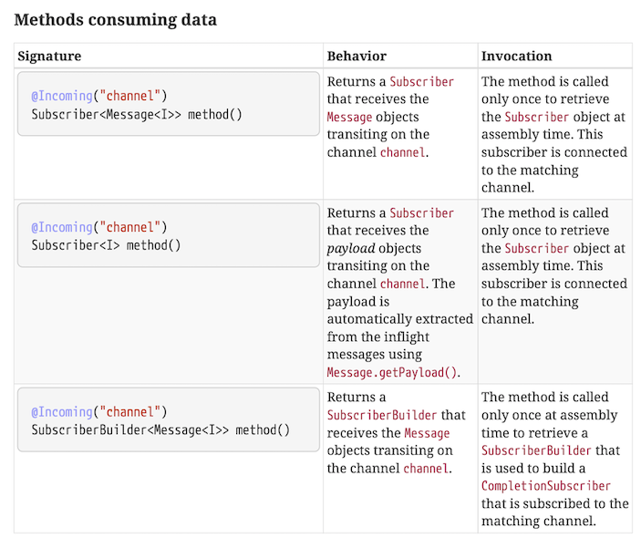

# Reactive Messaging


Kafka is the Swiss Army Chainsaw of messaging.


## Microprofile Reactive Messaging Spec

Microprofile Reactive Messaging specifies an annotation based model for creating event-driven microservices.

It has two main annotations:

* `@Incoming` to let a method _read_ messages from a _channel_.
* `@Outgoing` to _write_ the return values of a method to a _channel_.


## Channels, Messages and Ack

Channels can be _internal_, to connect different beans to each other, or _external_, for example to connect them to Kafka. In Quarkus, this is managed by configuration.

Messages are the items that are produced by and written to Channels. It's a minimal interface that only contains methods to retrieve the payload, and to acknowledge the message.

To acknowledge the message means to tell the producer of the message that we've succesfully processed it, and don't need to retrieve it again.

Note:
A typical implementation (for example for Kafka) will have a richer class that extends `Message`, like `KafkaRecord`. 


## Internal Channels

```java [|1-8|10-14|16-19|]
@Outgoing("greet-subjects")
public Multi<String> greetSubjectsProducer() {
    return Multi.createFrom()
            .ticks()
            .every(Duration.ofSeconds(1))
            .map(__ -> faker.name().fullName())
            .onOverflow().buffer(1);
}

@Incoming("greet-subjects")
@Outgoing("greets")
public String greetSubjectsConsumer(String subject) {
    return "Hello " + subject + "!";
}

@Incoming("greets")
public void greetPrinter(String greet) {
    System.out.println(greet);
}
```

Note:
* This requires no configuration. The channels 'match', both are mentioned once for incoming and once for outgoing, so it can be connected internally.
* The top one is a producer
* The middle one is a processor, consumes and produces
* The bottom one is a consumer


## Signatures

Other signatures are supported as well:

```java [|3-6|10|]
@Incoming("greet-subjects")
@Outgoing("greets")
public Multi<String> greetSubjectsConsumer(String subject) {
  return Multi.createFrom().items(
    "Hey " + subject + "!",
    "Ho " + subject + "!");
}

@Incoming("greets")
public CompletableFuture<Message<?>> greetPrinter(Message<String> greet) {
    System.out.println(greet.getPayload());
    return CompletableFuture.completedFuture(greet);
}
```

Note:
* In the first example, instead of a single message, we return a Multi. These get concatenated into the stream, so effectively this is a `flatMap` processor now.
* In the second example, we inject the full `Message` rather than only the payload. This would allow us to manually control acknowledging.

Note that in the second example, a `CompletionStage` is returned. This is needed, otherwise the implementation would have to block until `greetPrinter` is finished before it can `ack` the message. Now it can subscribe on the completion of the `CompletionStage` to acknowledge the message.


## Signatures

All possibilities are specified in the Microprofile Reactive Messaging Specification:




Note:
* In the screenshot you see that a method that receives messages doesn't need to process the messages itself, it can also return a subscriber instance!


## Connecting to Kafka

To connect to Kafka instead of through internal channels we need:

* The `quarkus-reactive-messaging-smallrye-kafka` extension
* Configure the Kafka Topics
* Configure the deserializer and serializer


## Connecting to Kafka

``` [|1,4|1-3|4-6|]
mp.messaging.incoming.greets-in.connector=smallrye-kafka
mp.messaging.incoming.greets-in.topic=greets
mp.messaging.incoming.greets-in.value.deserializer=com.lunatech.training.quarkus.reactive.GreetDeserializer
mp.messaging.outgoing.greets-out.connector=smallrye-kafka
mp.messaging.outgoing.greets-out.topic=greets
mp.messaging.outgoing.greets-out.value.serializer=io.quarkus.kafka.client.serialization.ObjectMapperSerializer
```

```java
public class GreetDeserializer extends ObjectMapperDeserializer<Greet> {

    public GreetDeserializer() {
        super(Greet.class);
    }

}
```

Note:
* We configure the `smallrye-kafka` connector
* We need a custom GreetDeserializer (that just extends the generic one) just to have it return the right type
* We can use the generic serializer
* We need to configure *two* channels here, one incoming and one outgoing


## Failure Strategies

Let's make our consumer crash occasionally:
```java [|5-7|] 
private int counter = 0;

@Incoming("greets-in")
public void greetPrinter(Greet greet) {
  if(++counter % 3 == 0) {
    throw new RuntimeException("Crashing on message for " + greet.subject);
  }

  System.out.println(greet.greet + " " + greet.subject);
}
```

This will cause the stream to terminate on the third message.

Note:
Every third message will crash.


## Failure Strategies

We can configure this behaviour with:

    mp.messaging.incoming.greets-in.failure-strategy=ignore

With this setting, it will log the error, but continue with the stream.

Note:
This can be useful in scenario's where we don't need to process every message per se.


## Failure Strategies

Another option:
    
    mp.messaging.incoming.greets-in.failure-strategy=dead-letter-queue

This moves bad messages to a *dead letter queue*, where another system - or human operators - can inspect it, and maybe reschedule it.


## Commit Strategies

Kafka is an _at-least-once_ delivery system. To indicate to Kafka that you've succesfully processed a message, you *commit* it. This will tell Kafka you don't need to see that particular message again. If you don't commit a message, then in case of a crash and a restart of your application, you will see the same message from Kafka again. 

SmallRye Reactive Messaging Kafka keeps track of all acknowledgements of messages, and based on that decides when to commit.


## Commit Strategies

Suppose the connector passed the following 8 messages to our app and received the following acknowledgements:

1. Acknowledged
2. Acknowledged
3. Acknowledged
4. Nothing
5. Acknowledged
6. Acknowledged
7. Nothing
8. Nothing

Now it can commit up to message #3, because everything up to message #3 has been acknowledged.

Note:
Ask the audience what happens after #3 gets committed, and then the application crashes and restarts?
Answer: All messages from 4 onwards are reprocessed.


## Commit Strategies

There are three commit strategies available:

* Ignore 
* Latest
* Throttled

Note:
* Ignore doesn't commit. Useful in combination with the 'auto commit' feature of the Kafka Client
* Latest commits as soon as a message is acknowledged. Could lead to a lot of commits, but minimizes reprocessing.

Also note:
When using `throttled`, there's a maximum time the connector waits for an `ack` or a `nack`. By default one minute. If a message is not acked or nacked after a minute, the connector will mark the application as unhealthy.


## Broadcasting


## 

TODO:
- Message acknowledgement  
- Message<T> instead of <T>
- Supporting multiple subscribers (broadcasting)
- Injecting publisher or multi
- Dead letter queue
- Health & Metrics integration
