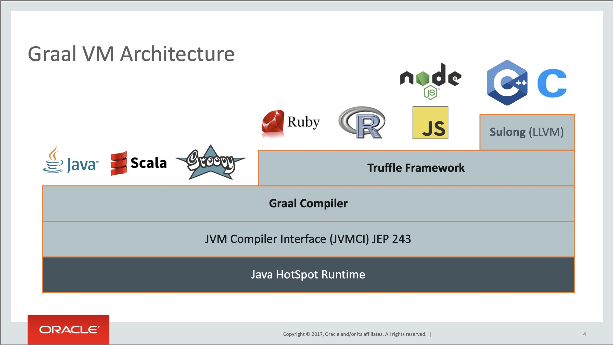

# GraalVM


## Learning outcomes

Après ce module, vous devrez savoir :
* Ce qu'est GraalVM et son rôle
* Compiler una application en exécutable natif
* Déboguer un exécutable natif


## Introduction

GraalVM is a JDK distribution allowing to optimize applications in JVM languages (Java, Scala, ...) and also supports other languages such as JavaScript or Python for example.

GraalVM can therefore mix several programming languages in a single application while eliminating the costs of external calls.

Note:
* GraalVM increases the performance of Java applications by around 32% on average


## Features

* Graal Compiler
* GraalVM Native Image
* Truffle Language Implementation Framework and GraalVM SDK
* LLVM Runtime and JavaScript Runtime

Note:
* Graal Compiler, new JIT compiler for Java
* GraalVM Native Image for AOT compilation -> Direct compilation of Java code into native machine code
* Truffle Language Implementation Framework and GraalVM SDK providing runtime environments for other programming languages
* LLVM Runtime and JavaScript Runtime, runtime environments for LLVM and JavaScript
* Possibility to install other languages and define our own


## Architecture



## Distributions of GraalVM

3 distributions :
* Oracle GraalVM Community Edition (CE)
* Oracle GraalVM Enterprise Edition (EE)
* Mandrel


## Mandrel

Mandrel’s main goal is to provide a way to build native executables specifically designed to support Quarkus and that target Linux containerized environments.

Mandrel releases are built from a code base derived from the upstream Oracle GraalVM CE code base, with only minor changes but some significant exclusions that are not necessary for Quarkus native apps.


## Native executable compilation

Use this command line to compile

```
./mvnw package -Pnative
```


## Test the native executable


## Full display of errors

* In the pom.xml file, add `<trimStackTrace>false</trimStackTrace>`

```xml
<artifactId>maven-failsafe-plugin</artifactId>
<version>${surefire-plugin.version}</version>
<configuration>
  <trimStackTrace>false</trimStackTrace>
</configuration>
```


## Test without compile again

To rerun tests with an existing native image

```
./mvnw test-compile failsafe:integration-test
```


<!-- .slide: data-background="#abcdef" -->
## Exercise: Use Graal VM


## Recap

In this module we have :
* Learnt what Graal VM is and his goal
* Compiled an application into a native executable
* Tested a native executable